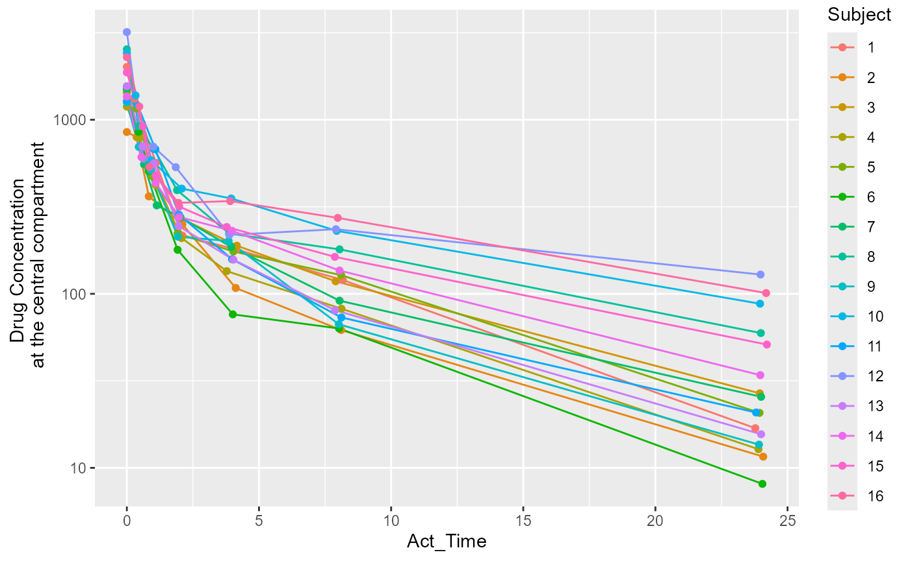
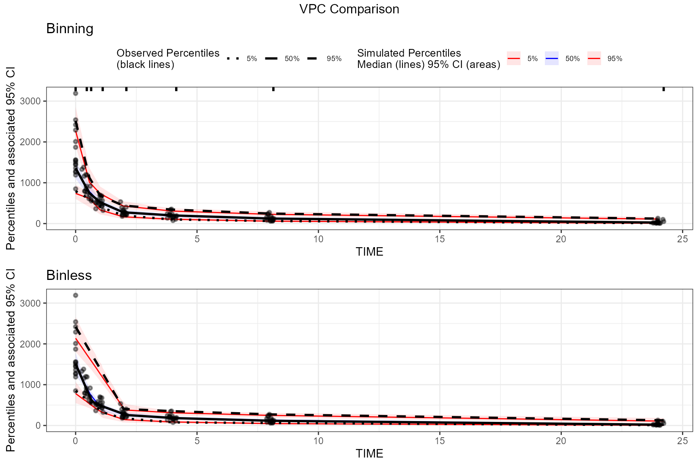

# tidyvpc with RsNLME

## Introduction

`tidyvpc` and the `Certara.RsNLME` package integrate well together for a
robust pharmacometric workflow. Build and estimate your model using
[RsNLME](https://certara.github.io/R-RsNLME/index.html) and easily pass
the observed and simulated output `data.frame` to `tidyvpc` for creating
visual predictive checks (VPCs). The below steps provide an example
workflow when using the `tidyvpc` and `Certara.RsNLME` package together.

## Setup

### R setup

First, you must install the `Certara.RsNLME` package. Complete
installation instructions can be found
[here](https://certara.github.io/R-RsNLME/articles/installation.html).

``` r

suppressPackageStartupMessages(library(tidyvpc, quietly = TRUE))
library(Certara.RsNLME)
library(ggplot2)
library(magrittr)
```

### Data Exploration

Let’s take a quick look at the time-concentration profile of our input
dataset. We will be using the `pkData` `data.frame` from the
`Certara.RsNLME` package.

``` r

conc_data <- Certara.RsNLME::pkData
conc_data$Subject <- as.factor(conc_data$Subject)
ggplot(conc_data, aes(x = Act_Time, y = Conc, group = Subject, color = Subject)) +
  scale_y_log10() +
  geom_line() +
  geom_point() +
  ylab("Drug Concentration \n at the central compartment")
```



### Model building

The above plot suggests that a two-compartment model with IV bolus is a
good starting point. Next, we will define the model using the
`numCompartments` argument inside the function
[`pkmodel()`](https://certara.github.io/R-RsNLME/reference/pkmodel.html)
from the `Certara.RsNLME` package, and provide additional ‘column
mapping’ arguments, which correspond to required model variables mapped
to column names in the `conc_data` `data.frame`.

We will then pipe in additional functions to remove the random effect
from `V2`, update initial estimates for fixed and random effects, then
change our error model.

``` r

model <- pkmodel(
  numCompartments = 2,
  data = conc_data,
  ID = "Subject",
  Time = "Act_Time",
  A1 = "Amount",
  CObs = "Conc",
  modelName = "Two-Cmpt") %>%
  structuralParameter(paramName = "V2", hasRandomEffect = FALSE) %>%
  fixedEffect(effect = c("tvV", "tvCl", "tvV2", "tvCl2"),
              value = c(15, 5, 40, 15)) %>%
  randomEffect(effect = c("nV", "nCl", "nCl2"),
               value = rep(0.1, 3)) %>%
  residualError(predName = "C", SD = 0.2)

print(model)
#> 
#>  Model Overview 
#>  ------------------------------------------- 
#> Model Name        :  Two-Cmpt
#> Working Directory :  C:/Repos/tidyvpc/vignettes/Two-Cmpt
#> Is population     :  TRUE
#> Model Type        :  PK
#> 
#>  PK 
#>  ------------------------------------------- 
#> Parameterization  :  Clearance
#> Absorption        :  Intravenous
#> Num Compartments  :  2
#> Dose Tlag?        :  FALSE
#> Elimination Comp ?:  FALSE
#> Infusion Allowed ?:  FALSE
#> Sequential        :  FALSE
#> Freeze PK         :  FALSE
#> 
#>  PML 
#>  ------------------------------------------- 
#> test(){
#>     cfMicro(A1,Cl/V, Cl2/V, Cl2/V2)
#>     dosepoint(A1)
#>     C = A1 / V
#>     error(CEps=0.2)
#>     observe(CObs=C * ( 1 + CEps))
#>     stparm(V = tvV * exp(nV))
#>     stparm(Cl = tvCl * exp(nCl))
#>     stparm(V2 = tvV2)
#>     stparm(Cl2 = tvCl2 * exp(nCl2))
#>     fixef( tvV = c(,15,))
#>     fixef( tvCl = c(,5,))
#>     fixef( tvV2 = c(,40,))
#>     fixef( tvCl2 = c(,15,))
#>     ranef(diag(nV,nCl,nCl2) = c(0.1,0.1,0.1))
#> }
#> 
#>  Structural Parameters 
#>  ------------------------------------------- 
#>  V Cl V2 Cl2
#>  ------------------------------------------- 
#> Observations:
#> Observation Name :  CObs
#> Effect Name      :  C
#> Epsilon Name     :  CEps
#> Epsilon Type     :  Multiplicative
#> Epsilon frozen   :  FALSE
#> is BQL           :  FALSE
#>  ------------------------------------------- 
#>  Column Mappings 
#>  ------------------------------------------- 
#> Model Variable Name : Data Column name
#> id                  : Subject
#> time                : Act_Time
#> A1                  : Amount
#> CObs                : Conc
```

### Model fitting

Next, we will fit the model using the function
[`fitmodel()`](https://certara.github.io/R-RsNLME/reference/fitmodel.html).

``` r

fit_est <- fitmodel(model)
```

### VPC preparation

Now that we have fit the model, we can create a new model with updated
parameter estimates and perform our VPC simulation run.

``` r

vpc_model <- copyModel(model, acceptAllEffects = TRUE, modelName = "Two-Cmpt-VPC")
print(vpc_model)
#> 
#>  Model Overview 
#>  ------------------------------------------- 
#> Model Name        :  Two-Cmpt-VPC
#> Working Directory :  C:/Repos/tidyvpc/vignettes/Two-Cmpt-VPC
#> Is population     :  TRUE
#> Model Type        :  PK
#> 
#>  PK 
#>  ------------------------------------------- 
#> Parameterization  :  Clearance
#> Absorption        :  Intravenous
#> Num Compartments  :  2
#> Dose Tlag?        :  FALSE
#> Elimination Comp ?:  FALSE
#> Infusion Allowed ?:  FALSE
#> Sequential        :  FALSE
#> Freeze PK         :  FALSE
#> 
#>  PML 
#>  ------------------------------------------- 
#> test(){
#>     cfMicro(A1,Cl/V, Cl2/V, Cl2/V2)
#>     dosepoint(A1)
#>     C = A1 / V
#>     error(CEps=0.161251376509829)
#>     observe(CObs=C * ( 1 + CEps))
#>     stparm(V = tvV * exp(nV))
#>     stparm(Cl = tvCl * exp(nCl))
#>     stparm(V2 = tvV2)
#>     stparm(Cl2 = tvCl2 * exp(nCl2))
#>     fixef( tvV = c(,15.3977961716836,))
#>     fixef( tvCl = c(,6.61266919198735,))
#>     fixef( tvV2 = c(,41.2018786759217,))
#>     fixef( tvCl2 = c(,14.0301337530406,))
#>     ranef(diag(nV,nCl,nCl2) = c(0.069404827604399,0.182196897237991,0.0427782148473702))
#> 
#> }
#> 
#>  Structural Parameters 
#>  ------------------------------------------- 
#>  V Cl V2 Cl2
#>  ------------------------------------------- 
#> Observations:
#> Observation Name :  CObs
#> Effect Name      :  C
#> Epsilon Name     :  CEps
#> Epsilon Type     :  Multiplicative
#> Epsilon frozen   :  FALSE
#> is BQL           :  FALSE
#>  ------------------------------------------- 
#>  Column Mappings 
#>  ------------------------------------------- 
#> Model Variable Name : Data Column name
#> id                  : Subject
#> time                : Act_Time
#> A1                  : Amount
#> CObs                : Conc
```

Next, we will use the
[`vpcmodel()`](https://certara.github.io/R-RsNLME/reference/vpcmodel.html)
function to perform simulation and generate the required observed and
simulated input `data.frame` for `tidyvpc`.

``` r

fit_vpc_sim <- vpcmodel(vpc_model)
```

The resulting observed and simulated data can be found in the returned
values from the
[`vpcmodel()`](https://certara.github.io/R-RsNLME/reference/vpcmodel.html)
function e.g.,

``` r

obs_data <- fit_vpc_sim$predcheck0
sim_data <- fit_vpc_sim$predout
```

### Generate VPC plots

The `x` and `y` arguments to
[`observed()`](https://github.com/certara/tidyvpc/reference/observed.md)
are the columns from `fit_vpc_sim$predcheck0` The `x` and `y` arguments
to
[`simulated()`](https://github.com/certara/tidyvpc/reference/simulated.md)
from `fit_vpc_sim$predout`. By default, `x` column is named `IVAR` and
`y` column is named `DV` in the output tables generated from
[`vpcmodel()`](https://certara.github.io/R-RsNLME/reference/vpcmodel.html).

``` r

# Create a binless VPC plot
binless_vpc <- observed(obs_data, x = IVAR, yobs = DV) %>%
  simulated(sim_data, ysim = DV) %>%
  binless() %>%
  vpcstats()
plot_binless_vpc <- plot(binless_vpc, legend.position = "none") +
  ggplot2::ggtitle("Binless")

# Create a binning VPC plot with binning method set to be "jenks"
binned_vpc <- observed(obs_data, x = IVAR, yobs = DV) %>%
  simulated(sim_data, ysim = DV) %>%
  binning(bin = "jenks") %>%
  vpcstats()
plot_binned_vpc <- plot(binned_vpc) +
  ggplot2::ggtitle("Binning")

## Put these two plots side-by-side
egg::ggarrange(plot_binned_vpc,
               plot_binless_vpc,
               nrow = 2, ncol = 1,
               top = "VPC Comparison"
)
```


