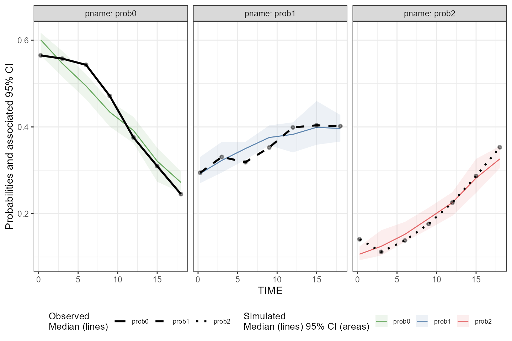
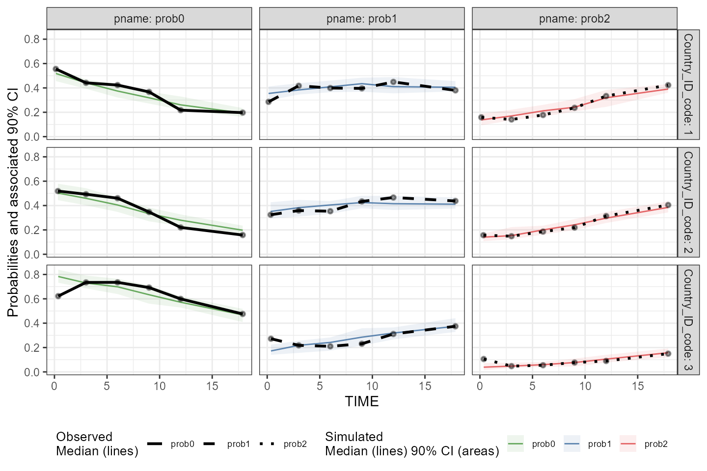
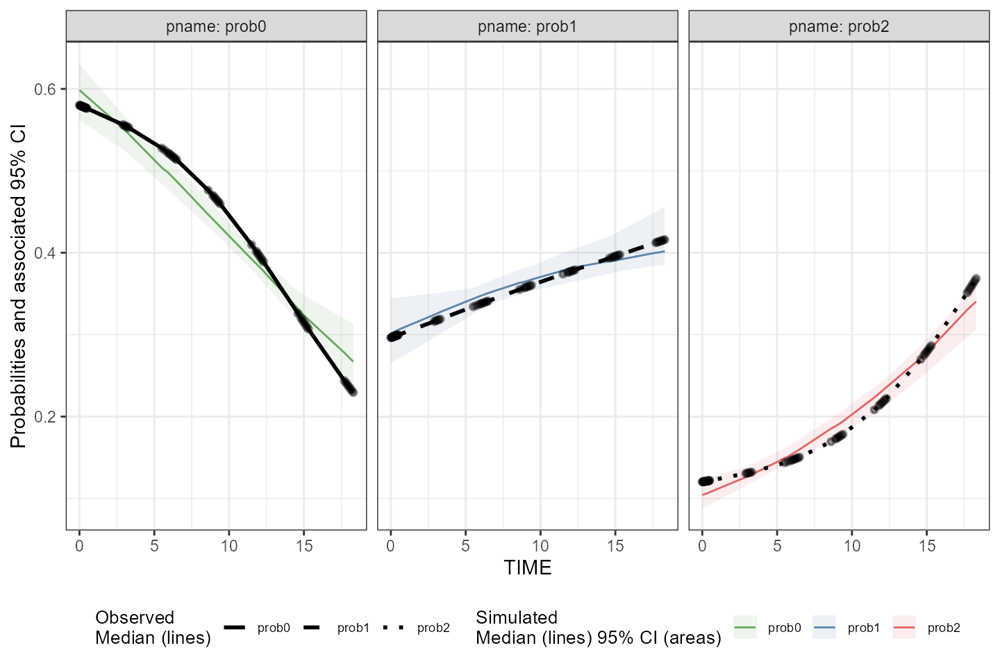
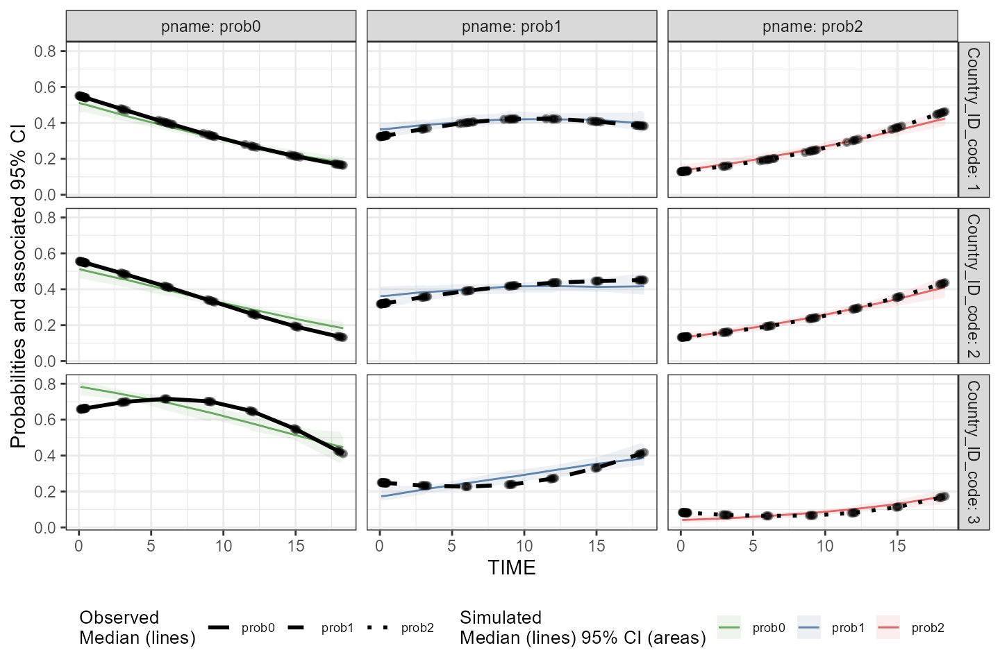
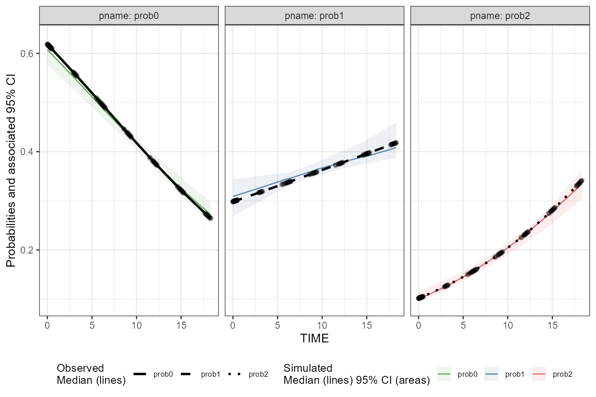
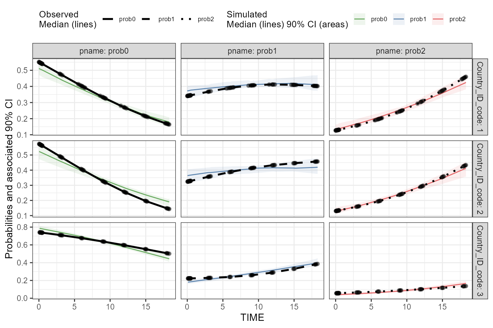
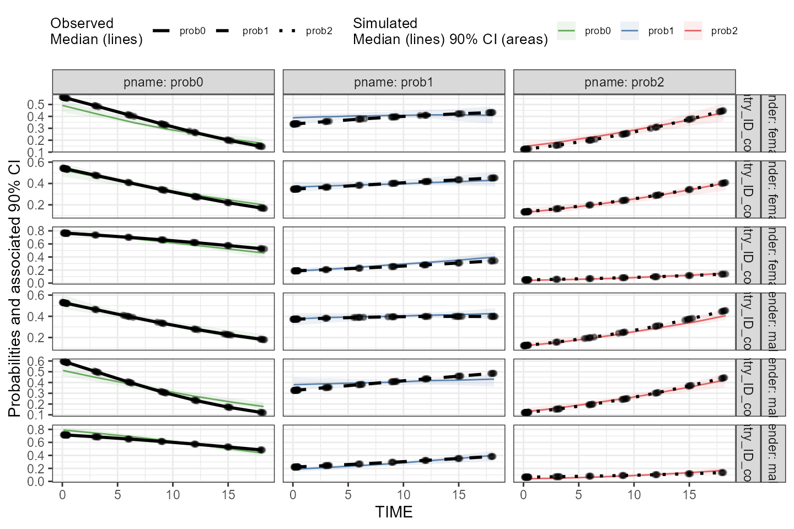

# Introduction to categorical VPC

## Introduction

The tidyvpc package allows users to generate VPC for categorical data
using both binning and binless methods.

## Data Setup

The tidyvpc package has specific ordering requirements for the observed
and simulated input datasets.

**Observed data must be ordered by: Subject-ID, IVAR (Time)**

**Simulated data must be ordered by: Replicate, Subject-ID, IVAR
(Time)**

The example datasets we’ll use in this vignette are correctly ordered,
but we will repeat this step for clarity.

``` r

library(tidyvpc)
library(data.table)

obs_cat_data <- tidyvpc::obs_cat_data
sim_cat_data <- tidyvpc::sim_cat_data

obs_cat_data <- obs_cat_data[order(PID_code, agemonths)]
sim_cat_data <- sim_cat_data[order(Replicate, PID_code, IVAR)]
```

## Binning

All traditional binning methods are available to the user, see
[`?binning`](https://github.com/certara/tidyvpc/reference/binning.md).
Note, additional methods available in the `classInt` package can be
provided in the `bin` argument.

The syntax for a continuous VPC and categorical VPC are nearly
identical, except in
[`vpcstats()`](https://github.com/certara/tidyvpc/reference/vpcstats.md)
function, specify `vpc.type = "categorical"`

In the example below, we’ll bin directly on our (rounded) x variable,
agemonths.

``` r


vpc <- observed(obs_cat_data, x = agemonths, yobs = zlencat) %>%
  simulated(sim_cat_data, ysim = DV) %>%
  binning(bin = round(agemonths, 0)) %>%
  vpcstats(vpc.type = "categorical")

plot(vpc, facet = TRUE, legend.position = "bottom", facet.scales = "fixed")
```



Let’s explore stratification and provide a different binning method in
the following VPC. We can also change our confidence level and quantile
type for the prediction intervals (shaded area) by specifying
`conf.level = .9` and `quantile.type = 6`.

*Note: Phoenix uses `quantile.type = 6` while tidyvpc uses
`quantile.type = 7` by default.*

``` r


vpc <- observed(obs_cat_data, x = agemonths, yobs = zlencat) %>%
  simulated(sim_cat_data, ysim = DV) %>%
  stratify(~ Country_ID_code) %>%
  binning(bin = "pam", nbins = 6) %>%
  vpcstats(vpc.type = "categorical", conf.level = .9, quantile.type = 6)

plot(vpc, facet = TRUE, legend.position = "bottom", facet.scales = "fixed")
```



## Binless

A binless approach was developed to fit categorical data using
`gam(family = "binomial")`. Users can optimize smoothing parameter for
the binless fit using `binless(optimize = TRUE)` (default), in which
case, the optimized smoothing parameters for each category of DV in the
observed data will be automatically defined by minimization of AIC.

### Optimize `sp` using AIC

``` r


vpc <- observed(obs_cat_data, x = agemonths, yobs = zlencat) %>%
  simulated(sim_cat_data, ysim = DV) %>%
  binless(optimize = TRUE) %>%
  vpcstats(vpc.type = "categorical", quantile.type = 6)

plot(vpc, facet = TRUE, legend.position = "bottom", facet.scales = "fixed")
```



We can increase the interval used to optimize value of smoothing
parameters using the `optimization.interval` argument of the
[`binless()`](https://github.com/certara/tidyvpc/reference/binless.md)
function.

``` r


vpc <- observed(obs_cat_data, x = agemonths, yobs = zlencat) %>%
  simulated(sim_cat_data, ysim = DV) %>%
  stratify(~ Country_ID_code) %>%
  binless(optimize = TRUE, optimization.interval = c(0,300)) %>%
  vpcstats(vpc.type = "categorical")

plot(vpc, facet = TRUE, legend.position = "bottom", facet.scales = "fixed")
```



### User-defined `sp`

Alternatively, users may supply their own smoothing parameters using the
`sp` argument.

This method uses `gam` with sp values specified for each level of
categorical DV.

*Note: The `sp` argument must be a list of the same length/order
corresponding to the unique values of our categorical DV. See additional
details in the next section, if stratification is specified.*

``` r

sort(unique(obs_cat_data$zlencat))
#> [1] 0 1 2
```

``` r


sp_user <- list(p0 = 300,
                p1 = 50,
                p2 = 100)
```

``` r

vpc <- observed(obs_cat_data, x = agemonths, yobs = zlencat) %>%
  simulated(sim_cat_data, ysim = DV) %>%
  binless(optimize = FALSE, sp = sp_user) %>%
  vpcstats(vpc.type = "categorical", quantile.type = 6)

plot(vpc, facet = TRUE, legend.position = "bottom", facet.scales = "fixed")
```



#### Specifying `sp` for each strata

##### One stratification variable

If providing user-supplied sp parameters with one or more stratification
variables, the order of sp should be specified as unique combination of
strata + DV, in ascending order.

``` r

sort(unique(obs_cat_data$Country_ID_code))
#> [1] 1 2 3
sort(unique(obs_cat_data$zlencat))
#> [1] 0 1 2
```

``` r

user_sp <- list(
           Country1_prob0 = 100,
           Country1_prob1 = 3,
           Country1_prob2 = 4,
           Country2_prob0 = 90,
           Country2_prob1 = 3,
           Country2_prob2 = 4,
           Country3_prob0 = 55,
           Country3_prob1 = 3,
           Country3_prob2 = 200)
```

Generate VPC

``` r

vpc <- observed(obs_cat_data, x = agemonths, yobs = zlencat) %>%
  simulated(sim_cat_data, ysim = DV) %>%
  stratify(~ Country_ID_code) %>%
  binless(optimize = FALSE, sp = user_sp) %>%
  vpcstats(vpc.type = "categorical"
           , conf.level = 0.9
           , quantile.type = 6
  )
plot(vpc, facet = TRUE)
```



##### Multiple stratification variables

If supplying `sp` argument with one or more stratification variables,
the order of elements in the list provided should be the following:
strat1, strat2, …, DV.

Add dummy strat variable to `obs_cat_data`:

``` r

library(dplyr)
#> 
#> Attaching package: 'dplyr'
#> The following objects are masked from 'package:data.table':
#> 
#>     between, first, last
#> The following objects are masked from 'package:stats':
#> 
#>     filter, lag
#> The following objects are masked from 'package:base':
#> 
#>     intersect, setdiff, setequal, union

obs_cat_data <- obs_cat_data %>%
  mutate(gender = ifelse(PID_code %% 2 == 1, "male", "female"))
```

``` r

vpc <- observed(obs_cat_data, x = agemonths, yobs = zlencat) %>%
  simulated(sim_cat_data, ysim = DV) %>%
  stratify(~ gender + Country_ID_code)
```

View ordering of stratification variables and DV:

``` r

sort(unique(obs_cat_data$gender))
#> [1] "female" "male"
sort(unique(obs_cat_data$Country_ID_code))
#> [1] 1 2 3
sort(unique(obs_cat_data$zlencat))
#> [1] 0 1 2
```

We first specified `gender`, then `Country_ID_code` in above formula, so
our list of smoothing parameters provided to `sp` argument should be
ordered as:

``` r

user_sp <- list(
  female.1.prob0 = 1,
  female.1.prob1 = 3,
  female.1.prob2 = 9,
  female.2.prob0 = 5,
  female.2.prob1 = 10,
  female.2.prob2 = 12,
  female.3.prob0 = 33,
  female.3.prob1 = 44,
  female.3.prob2 = 88,
  male.1.prob0 = 4,
  male.1.prob1 = 12,
  male.1.prob2 = 15,
  male.2.prob0 = 800,
  male.2.prob1 = 19,
  male.2.prob2 = 28,
  male.3.prob0 = 22,
  male.3.prob1 = 88,
  male.3.prob2 = 11
)
```

Generate VPC

``` r

vpc <- observed(obs_cat_data, x = agemonths, yobs = zlencat) %>%
  simulated(sim_cat_data, ysim = DV) %>%
  stratify(~ gender + Country_ID_code) %>%
  binless(optimize = FALSE, sp = user_sp) %>%
  vpcstats(vpc.type = "categorical", conf.level = 0.9, quantile.type = 6)

plot(vpc, facet=TRUE)
```


