# Introduction to continuous VPC

## Introduction

**When deriving a Visual Predictive Check (VPC) you must:**

- Have both observed and simulated datasets that include x and y
  variables, typically TIME and DV

- Compute prediction intervals on simulated versus observed data

**When deriving a VPC you may want to:**

- Stratify over variables in your model

- Censor data below LLOQ

- Perform prediction correction (pcVPC)

**The tidyvpc package makes these steps fast and easy:**

- By providing readable syntax using the `%>%` operator from magrittr.

- By using efficient backend computation, taking advantage of
  `data.table` parallelization.

- By providing traditional binning methods and new [binless
  methods](https://doi.org/10.1002/psp4.12319)

- By using ggplot2 graphics engine to visualize the results of the VPC.

------------------------------------------------------------------------

This document introduces you to the `tidyvpc` set of tools, and shows
you how to apply them to `tidyvpcobj` to derive VPC.

All of the `tidyvpc` functions require the `tidyvpcobj` as the first
argument, with the exception of the first function
[`observed()`](https://github.com/certara/tidyvpc/reference/observed.md)
in the piping chain, which takes a `data.frame` or `data.table` of the
observed dataset. Rather than forcing the user to either save
intermediate objects or nest functions, `tidyvpc` provides the `%>%`
operator from magrittr. The result from one step is then “piped” into
the next step, with the final function in the piping chain always
[`vpcstats()`](https://github.com/certara/tidyvpc/reference/vpcstats.md).
You can use the pipe to rewrite multiple operations that you can read
left-to-right, top-to-bottom (reading the pipe operator as “then”).

## Data

To explore the functionality of tidyvpc, we’ll use an altered version of
obs_data(`vpc::simple_data$obs`) and sim_data(`vpc::simple_data$sim`)
from the vpc package. These datasets contain all necessary variables to
explore the functionality of tidyvpc including:

- DV (y variable)

- TIME (x variable)

- NTIME (nominal time for binning on x-variable)

- GENDER (gender variable for stratification, “M”, “F”)

- STUDY (study for stratification, “Study A”, “Study B”)

- PRED (prediction variable for pcVPC)

- MDV (Missing DV)

### Data Structure

`tidyvpc` requires specific structure of observed and simulated data to
successfully generate VPC.

See
[`tidyvpc::obs_data`](https://github.com/certara/tidyvpc/reference/obs_data.md)
and
[`tidyvpc::sim_data`](https://github.com/certara/tidyvpc/reference/sim_data.md)
for example [data
structure](https://certara.github.io/tidyvpc/#data-preprocessing).

``` r

obs_data <- data.table::as.data.table(tidyvpc::obs_data)
head(obs_data)
#>       ID      TIME    DV   AMT  DOSE   MDV NTIME GENDER   STUDY
#>    <int>     <num> <num> <int> <int> <int> <num> <char>  <char>
#> 1:     1 0.0000000   0.0   150   150     1  0.00      M Study A
#> 2:     1 0.2157624  37.3     0   150     0  0.25      M Study A
#> 3:     1 0.4694366  62.2     0   150     0  0.50      M Study A
#> 4:     1 0.8271844  74.1     0   150     0  1.00      M Study A
#> 5:     1 1.7724895  75.1     0   150     0  1.50      M Study A
#> 6:     1 1.7142415  58.3     0   150     0  2.00      M Study A
```

``` r

sim_data <- data.table::as.data.table(tidyvpc::sim_data)
head(sim_data)
#>       ID   REP      TIME     DV  IPRED   PRED   AMT  DOSE   MDV NTIME
#>    <int> <int>     <num>  <num>  <num>  <num> <int> <int> <int> <num>
#> 1:     1     1 0.0000000  0.000  0.000  0.000   150   150     1  0.00
#> 2:     1     1 0.2157624 24.470 22.400 29.931     0   150     0  0.25
#> 3:     1     1 0.4694366 49.541 38.780 49.995     0   150     0  0.50
#> 4:     1     1 0.8271844 56.510 58.644 69.981     0   150     0  1.00
#> 5:     1     1 1.7724895 63.165 67.310 73.799     0   150     0  1.50
#> 6:     1     1 1.7142415 66.649 69.466 69.487     0   150     0  2.00
```

### Preprocessing data

First, we’ll need to subset our data by filtering `MDV == 0`, which
removes rows where both `DV == 0` and `TIME == 0`.

``` r

obs_data <- obs_data[MDV == 0]
sim_data <- sim_data[MDV == 0]
```

Next, we’ll add the prediction variable from the first replicate of
simulated data into our observed data.

``` r

obs_data$PRED <- sim_data[REP == 1, PRED]
```

## `observed()`

The
[`observed()`](https://github.com/certara/tidyvpc/reference/observed.md)
function is always the first function used in the VPC piping chain and
is used to specify the observed dataset and corresponding variables.
There are three arguments that are required to use `observed`. The first
argument is either a `data.frame` or `data.table`, the second argument
is the name of x-variable in the observed data, and the third argument
is the name of the y-variable. Note that variable names should be
unquoted.

``` r

library(tidyvpc)
vpc <- observed(obs_data, x = TIME, y = DV)
```

## `simulated()`

The
[`simulated()`](https://github.com/certara/tidyvpc/reference/simulated.md)
function is used to specify the simulated dataset and corresponding
variables. There are two arguments that are required in order to use
[`simulated()`](https://github.com/certara/tidyvpc/reference/simulated.md).
Since the function is “piped” in after the
[`observed()`](https://github.com/certara/tidyvpc/reference/observed.md)
function, the first argument is the tidyvpcobj and should not be
included, followed by the name of the simulated data, then the name of
y-variable in the simulated data. Variable names should be unquoted and
x-variable should not be included as it is recycled from the
[`observed()`](https://github.com/certara/tidyvpc/reference/observed.md)
function.

``` r

vpc <- observed(obs_data, x = TIME, y = DV) %>%
  simulated(sim_data, y = DV)
```

## `binning()`

The
[`binning()`](https://github.com/certara/tidyvpc/reference/binning.md)
function provides the binning method to derive the VPC and should be
inputted as a character string in the `bin` argument. Binning methods
include: “ntile”, “pam”, “sd”, “equal”, “pretty”, “quantile”, “kmeans”,
“jenks”, “centers”, “breaks”. Some methods such as “ntile” and “pam”
will require you to specify the number of bins using the `nbins`
argument (e.g., `nbins = 9`).

If using `bin = "centers"` or `bin = "breaks`, you must also provide the
centers/breaks argument as a numeric vector in the function (e.g.,
`centers = c(1,3,5,7)`).

You can also bin directly on x-variable. If using this type of binning,
the bin argument should be the unquoted variable name that you used in
the
[`observed()`](https://github.com/certara/tidyvpc/reference/observed.md)
function (e.g., `bin = NTIME` for the Nominal Time variable in the
data).

Binning on x-variable, NTIME

``` r

vpc <- observed(obs_data, x=TIME, y=DV) %>%
    simulated(sim_data, y=DV) %>%
    binning(bin = NTIME)
```

Binning with “ntile”

``` r

vpc <- observed(obs_data, x = TIME, y = DV) %>%
  simulated(sim_data, y = DV) %>%
  binning(bin = "ntile", nbins = 9)
```

Binning with “breaks”

``` r

vpc <- observed(obs_data, x = TIME, y = DV) %>%
  simulated(sim_data, y = DV) %>%
  binning(bin = "breaks", breaks = c(1,5,7,9,10))
```

## `binless()`

*Note: The
[`binless()`](https://github.com/certara/tidyvpc/reference/binless.md)
examples below relate to a continuous VPC. See
[examples](https://certara.github.io/tidyvpc/articles/tidyvpc_cat.html)
of
[`binless()`](https://github.com/certara/tidyvpc/reference/binless.md)
implementation for categorical VPC.*

Binless methods for continuous VPC use Additive Quantile Regression
(AQR) in place of traditional binning. By default,
[`binless()`](https://github.com/certara/tidyvpc/reference/binless.md)
performs AQR at the 5%, 50%, and 95% quantiles, but you can change this
using the `qpred` argument in
[`vpcstats()`](https://github.com/certara/tidyvpc/reference/vpcstats.md),
which takes a numeric vector of length 3 (e.g., `qpred = c(.1, .5, .9)`
for the 10%, 50%, 90% quantiles).

The lambda smoothing parameters for each quantile are optimized by
default with AIC as indicated by the `optimize = TRUE` argument. If you
would like to use different lambda values for each quantile set
`optimize = FALSE` and specify lambda values for each quantile as a
numeric vector of length 3 with the `lambda` argument (e.g.,
`lambda = c(1,3,2)` corresponds to the lambda values for the quantiles
in the `qpred` argument (lower, median, upper)). Note: The higher the
lambda value the smoother the fit to the data.

Binless optimized

``` r

vpc <- observed(obs_data, x=TIME, y=DV) %>%
    simulated(sim_data, y=DV) %>%
    binless()
```

Binless with user-specified lambda values at 10%, 50%, 90% quantiles.
Set `optimize = FALSE` and provide lambda smoothing parameters as a
vector of length 3 for lower, median, upper quantiles.

``` r

vpc <- observed(obs_data, x=TIME, y=DV) %>%
    simulated(sim_data, y=DV) %>%
    binless(qpred = c(0.1, 0.5, 0.9), optimize = FALSE, lambda = c(1,3,2))
```

## `vpcstats()`

The
[`vpcstats()`](https://github.com/certara/tidyvpc/reference/vpcstats.md)
function is always the final function used in the piping chain and
calculates the statistics needed to plot a VPC. If using
[`binning()`](https://github.com/certara/tidyvpc/reference/binning.md)methods,
you may specify alternative quantiles using the `qpred` argument. The
default quantiles used are 5%, 50%, 95% (e.g.,
`qpred = c(0.05, 0.5, 0.95)`).

``` r

vpc <- observed(obs_data, x=TIME, y=DV) %>%
    simulated(sim_data, y=DV) %>%
    binning(bin = NTIME) %>%
    vpcstats()

plot(vpc)
```

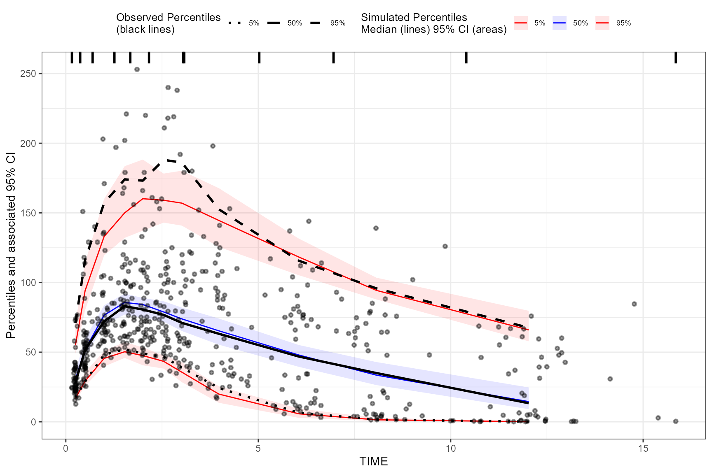

## `stratify()`

To stratify VPC, include the
[`stratify()`](https://github.com/certara/tidyvpc/reference/stratify.md)
function before using the
[`binning()`](https://github.com/certara/tidyvpc/reference/binning.md)
or
[`binless()`](https://github.com/certara/tidyvpc/reference/binless.md)
function and use the unquoted stratification variable(s) name as a
formula. Let’s stratify on `GENDER` in the data, which contains 2 levels
(GENDER = “M”, GENDER = “F”). Include as many stratification variables
as your model calls for.

``` r

vpc <- observed(obs_data, x=TIME, y=DV) %>%
    simulated(sim_data, y=DV) %>%
    stratify(~ GENDER) %>%
    binning(bin = "pam", nbins = 7) %>%
    vpcstats()

plot(vpc)
```

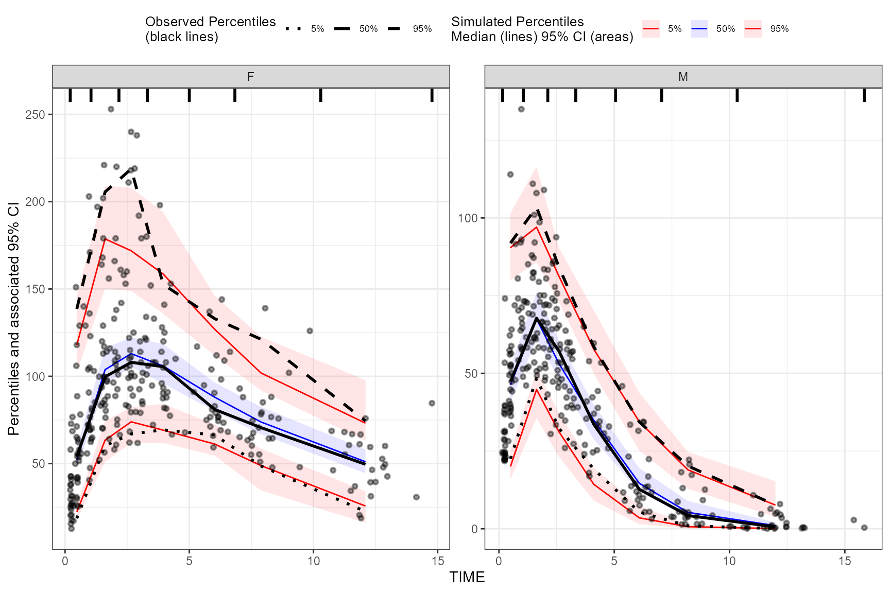

Using multiple stratification variables `GENDER` and `STUDY`.

``` r


vpc <- observed(obs_data, x=TIME, y=DV) %>%
    simulated(sim_data, y=DV) %>%
    stratify(~ GENDER + STUDY) %>%
    binless() %>%
    vpcstats()

plot(vpc)
```

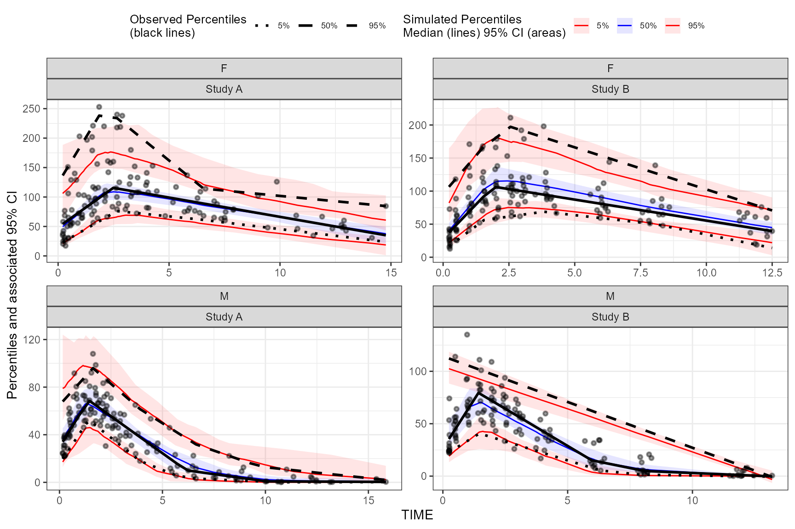

## `censoring()`

*Note: The
[`censoring()`](https://github.com/certara/tidyvpc/reference/censoring.md)
function is only applicable for continuous VPC.*

To censor observed data below lower limit of quantification (LLOQ),
include the
[`censoring()`](https://github.com/certara/tidyvpc/reference/censoring.md)
function after
[`simulated()`](https://github.com/certara/tidyvpc/reference/simulated.md)
and use the `lloq` argument to specify either a variable in the data or
specific value for censoring. The `blq` argument creates a logical
TRUE/FALSE in the data that indicates whether the value is below the
limit of quantification and is typically defined as rows with DV \< LLOQ
in the data. Using the
[`censoring()`](https://github.com/certara/tidyvpc/reference/censoring.md)
function will censor only observed data below lower limit of
quantification when plotting, simulated data will still be plotted.

Censoring using numeric value.

``` r

vpc <- observed(obs_data, x=TIME, y=DV) %>%
    simulated(sim_data, y=DV) %>%
    censoring(blq=(DV < 25), lloq=25) %>%
    binning(bin = "jenks", nbins = 5) %>%
    vpcstats()

plot(vpc, censoring.type = "blq")
```

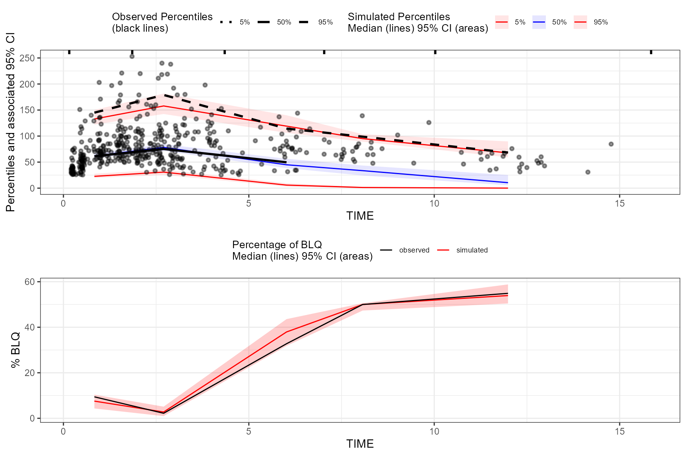

The `tidyvpc` package also allows you to use LLOQ values within your
data and different LLOQ for each level of stratification variable. We’ll
set an `LLOQ` value of `50` for `Study A` and `25` for `Study B` and
calculate statistics at 10%, 50%, 90% quantiles.

``` r

obs_data$LLOQ <- obs_data[, ifelse(STUDY == "Study A", 50, 25)]

vpc <- observed(obs_data, x=TIME, y=DV) %>%
    simulated(sim_data, y=DV) %>%
    censoring(blq=(DV < LLOQ), lloq=LLOQ) %>%
    stratify(~ STUDY) %>%
    binning(bin = "pam", nbins = 4) %>%
    vpcstats(qpred = c(0.1, 0.5, 0.9))

plot(vpc, censoring.type = "blq", facet.scales = "fixed")
```

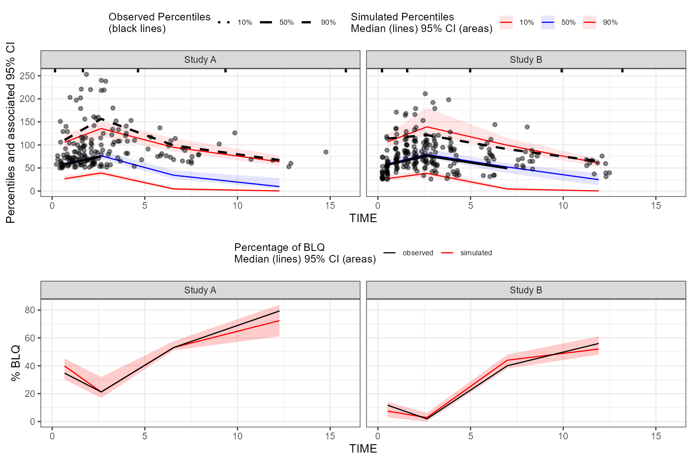

The `tidyvpc` package also supports usage of
[`censoring()`](https://github.com/certara/tidyvpc/reference/censoring.md)
with ALQ data, similar to above usage with BLQ data.

``` r

obs_data$ULOQ <- obs_data[, ifelse(STUDY == "Study A", 125, 100)]

vpc <- observed(obs_data, x = TIME, y = DV) |>
  simulated(sim_data, y = DV) |>
  censoring(alq = DV > ULOQ, uloq = ULOQ) |>
  stratify(~ STUDY) |>
  binning(bin = NTIME) |>
  vpcstats(qpred = c(0.1, 0.5, 0.9))
```

To plot the above `vpc` and include the percentage of ALQ plot, you’d
run `plot(vpc, censoring.type = "alq")`.

If using
[`censoring()`](https://github.com/certara/tidyvpc/reference/censoring.md)
with both ALQ and BLQ data, set `censoring.type = "both"` in the
[`plot()`](https://rdrr.io/r/graphics/plot.default.html) function to
display both percentage of BLQ and ALQ plots as a grid in the resulting
VPC plot.

``` r

obs_data$LLOQ <- obs_data[, ifelse(STUDY == "Study A", 50, 25)]
obs_data$ULOQ <- obs_data[, ifelse(STUDY == "Study A", 125, 100)]

vpc <- observed(obs_data, x = TIME, y = DV) |>
  simulated(sim_data, y = DV) |>
  censoring(blq = DV < LLOQ, lloq = LLOQ,  alq = DV > ULOQ, uloq = ULOQ) |>
  stratify(~ STUDY) |>
  binning(bin = NTIME) |>
  vpcstats(qpred = c(0.1, 0.5, 0.9))

plot(vpc, censoring.type = "both", facet.scales = "fixed")
```

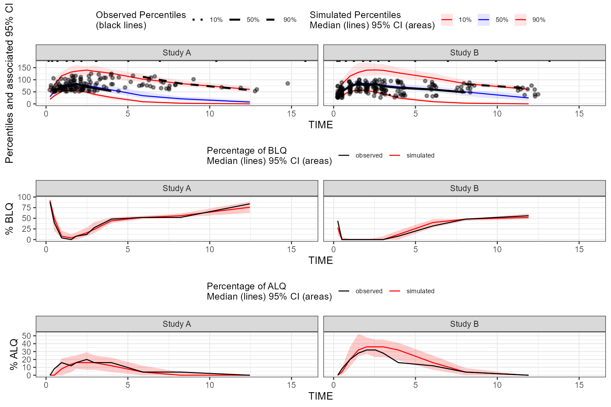

If you want to return the percentage of BLQ and/or ALQ plots
individually as elements in a list, instead of arranged in a grid, use
the `censoring.output` argument e.g.,
`plot_list <- plot(vpc, censoring.type = "both", censoring.output = "list")`.

### Customizing Censoring Plot Colors

You can customize the colors of the censoring plots using the
`censoring.color` and `censoring.fill` arguments. The `censoring.color`
argument accepts a named vector with `"observed"` and `"simulated"`
elements for line colors, while `censoring.fill` controls the ribbon
fill color.

``` r

plot(vpc, censoring.type = "blq",
     censoring.color = c(observed = "blue", simulated = "orange"),
     censoring.fill = "orange",
     facet.scales = "fixed")
```

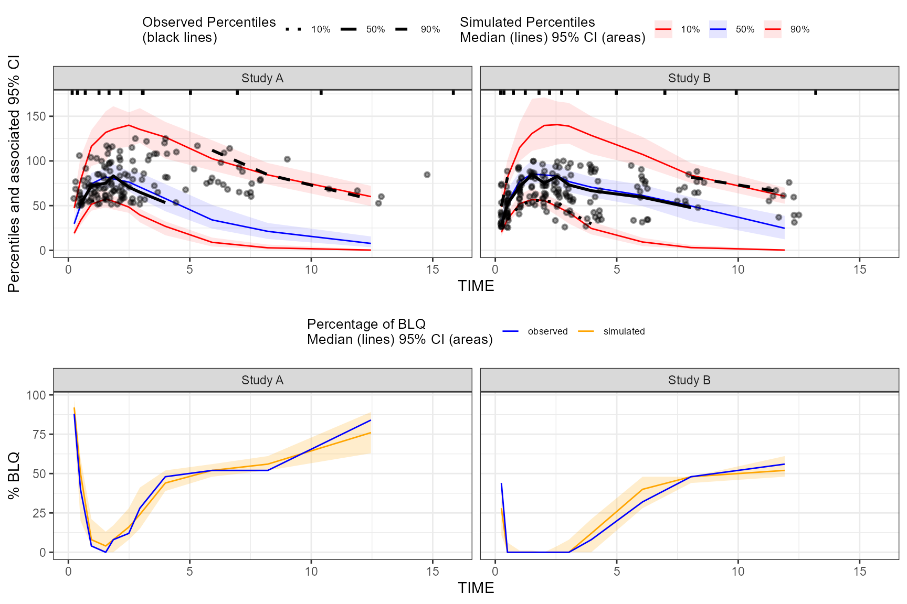

For more advanced customization using ggplot2 functions, use
`censoring.output = "list"` to return individual ggplot objects that can
be modified directly:

``` r

plot_list <- plot(vpc, censoring.type = "blq", censoring.output = "list")
# Modify the BLQ plot (second element in the list)
plot_list[[2]] + ggplot2::labs(colour = "Custom Legend Title")
```

## `predcorrect()`

*Note: The
[`predcorrect()`](https://github.com/certara/tidyvpc/reference/predcorrect.md)
function is only applicable for continuous VPC.*

To derive a prediction corrected VPC (pcVPC), use the
[`predcorrect()`](https://github.com/certara/tidyvpc/reference/predcorrect.md)
function. The
[`predcorrect()`](https://github.com/certara/tidyvpc/reference/predcorrect.md)
function requires the argument, `pred`, which should be the unquoted
variable name of the population prediction variable in the data. The
[`predcorrect()`](https://github.com/certara/tidyvpc/reference/predcorrect.md)
function may be called either before or after specifying
[`binning()`](https://github.com/certara/tidyvpc/reference/binning.md)/[`binless()`](https://github.com/certara/tidyvpc/reference/binless.md).
If using the
[`binless()`](https://github.com/certara/tidyvpc/reference/binless.md)
function with
[`predcorrect()`](https://github.com/certara/tidyvpc/reference/predcorrect.md),
LOESS pcVPC will be performed.

*Note: If the model was fit using log scale of DV, make sure to include
the argument `log = TRUE` in
[`predcorrect()`](https://github.com/certara/tidyvpc/reference/predcorrect.md)
to perform the appropriate prediction correction calculation.*

Prediction corrected using binning methods.

``` r

vpc <- observed(obs_data, x=TIME, y=DV) %>%
    simulated(sim_data, y=DV) %>%
    stratify(~GENDER) %>%
    binning(bin = NTIME) %>%
    predcorrect(pred=PRED) %>%
    vpcstats()

plot(vpc)
```

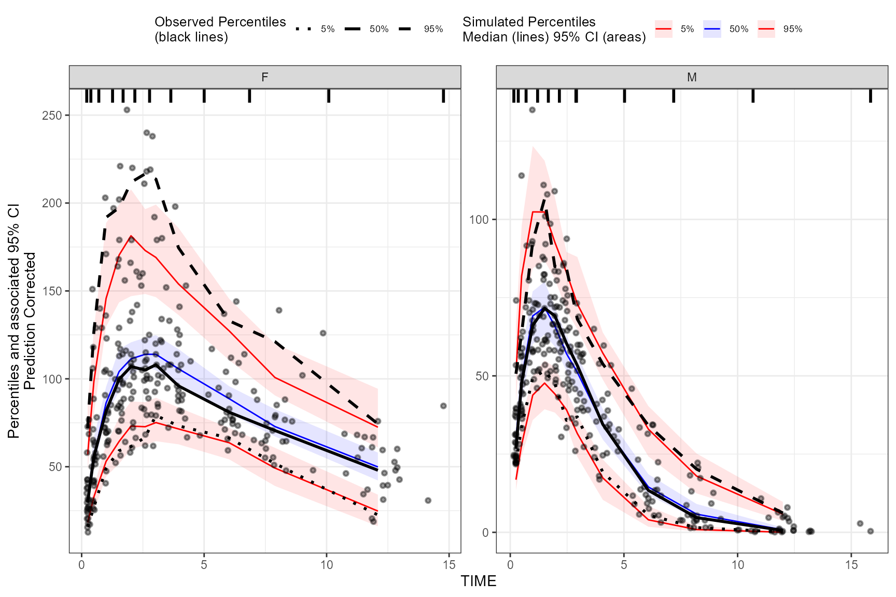

LOESS prediction corrected using binless method for 10%, 50%, 90%
quantiles. If `optimize = TRUE`, the LOESS smoothing parameter, span,
will be automatically optimized using AIC.

``` r

vpc <- observed(obs_data, x=TIME, y=DV) %>%
    simulated(sim_data, y=DV) %>%
    stratify(~GENDER) %>%
    binless(qpred = c(0.1, 0.5, 0.9), optimize = TRUE) %>%
    predcorrect(pred=PRED) %>%
    vpcstats()

plot(vpc)
```

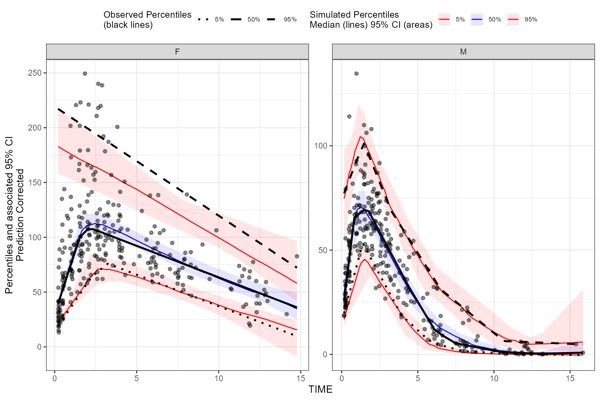

To specify your own smoothing value for LOESS pcVPC instead of
optimizing with AIC, use the `span` argument in the
[`binless()`](https://github.com/certara/tidyvpc/reference/binless.md)
function. The `span` argument is a numeric value between \[0,1\], with
higher values providing a smoother fit. Remember, to also include the
smoothing parameters for AQR by using the `lambda` argument and set
`optimize = FALSE`.

``` r

vpc <- observed(obs_data, x=TIME, y=DV) %>%
    simulated(sim_data, y=DV) %>%
    predcorrect(pred=PRED) %>%
    binless(optimize = FALSE, lambda = c(.95,3,1.2), span = .6) %>%
    vpcstats()

plot(vpc)
```

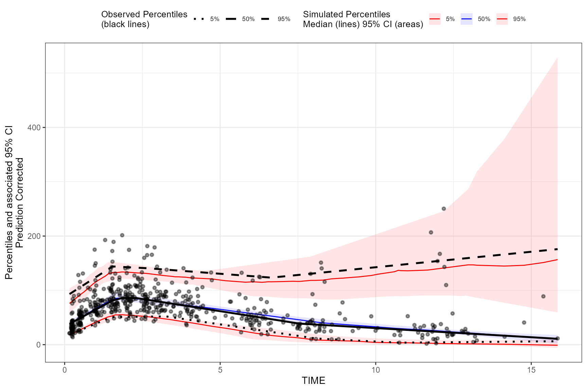

## Extending further

Below are some examples of advanced use cases of the `tidyvpc` package.

### Different binning methods by strata

To use different binning methods for different stratification variables,
and/or for each level of stratification variable, use multiple calls to
the
[`binning()`](https://github.com/certara/tidyvpc/reference/binning.md)
function in combination with the `stratum` argument. Make sure to set
`by.strata = T`

``` r

vpc <- observed(obs_data, x=TIME, y=DV) %>%
    simulated(sim_data, y=DV) %>%
    stratify(~ GENDER + STUDY) %>%
    binning(stratum = list(GENDER = "M", STUDY = "Study A"), bin = "jenks", nbins = 5, by.strata = T) %>%
    binning(stratum = list(GENDER = "F", STUDY = "Study A"), bin = "centers", centers = c(0.5,3,5,10,15), by.strata = T) %>%
    binning(stratum = list(GENDER = "M", STUDY = "Study B"), bin = "kmeans", by.strata = T) %>%
    binning(stratum = list(GENDER = "F", STUDY = "Study B"), bin = "pam", nbins = 5, by.strata = T) %>%
    predcorrect(pred=PRED) %>%
    vpcstats()

plot(vpc)
```

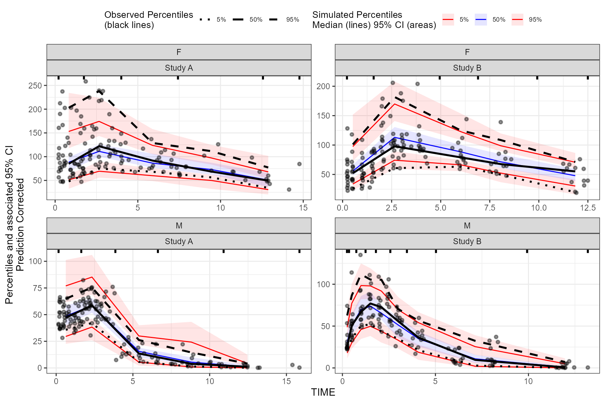

### Different smoothing values for each level of stratification variable

To use different smoothing parameters for each level of stratification
variable if using the
[`binless()`](https://github.com/certara/tidyvpc/reference/binless.md)
function, use a single call of the
[`binless()`](https://github.com/certara/tidyvpc/reference/binless.md)
function and include a `data.frame` with the column names of
stratification variable and corresponding level. To use different `span`
values for each level of stratification variable, use a vector the
length of n levels of strata. Note: If using more than one
stratification variable with the
[`binless()`](https://github.com/certara/tidyvpc/reference/binless.md)
function, you must set `optimize = TRUE` and optimize lambda and span
using AIC.

``` r

user_lambda <- data.frame(GENDER_F = c(2,4,2), GENDER_M = c(1.9,3,2.25) )

vpc <- observed(obs_data, x=TIME, y=DV) %>%
    simulated(sim_data, y=DV) %>%
    stratify(~ GENDER) %>%
    binless(optimize = FALSE, lambda = user_lambda, span = c(.6, .85)) %>%
    predcorrect(pred=PRED) %>%
    vpcstats(qpred = c(0.1, 0.5, 0.9))

plot(vpc)
```

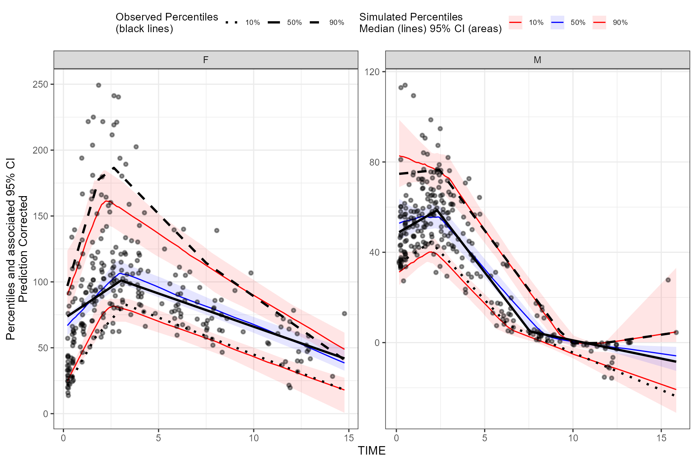

### Visualize bins

If using
[`binning()`](https://github.com/certara/tidyvpc/reference/binning.md)
methods, you can visualize bins by using the
[`plot()`](https://rdrr.io/r/graphics/plot.default.html) function on the
`tidyvpcobj` without calling
[`vpcstats()`](https://github.com/certara/tidyvpc/reference/vpcstats.md).
Once you are satisfied with the binning method, simply call
[`vpcstats()`](https://github.com/certara/tidyvpc/reference/vpcstats.md)
on the existing `tidyvpcobj` to compute VPC percentiles and prediction
intervals (e.g., `vpc %>% vpcstats()`).

``` r

vpc <- observed(obs_data, x=TIME, y=DV) %>%
    simulated(sim_data, y=DV) %>%
    binning(bin = "jenks", nbins = 7)

plot(vpc)
```

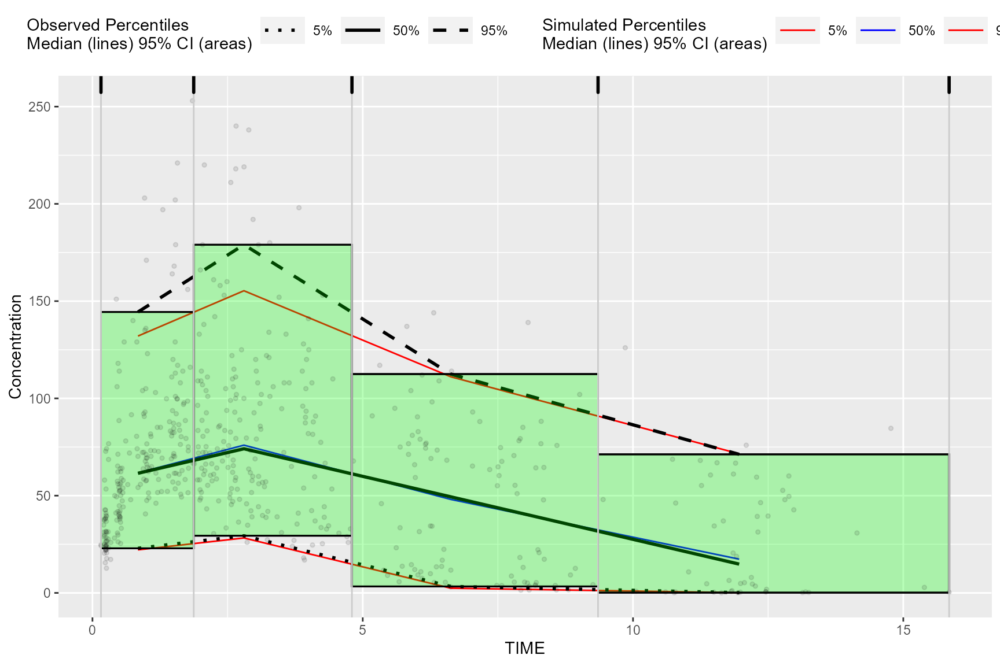

### Obtain bin information

To obtain information about the bins, including the number of
observations, xmedian, xmean, xmin, xmax, xmidpoint, xleft, xright, and
xcenter, use the
[`bininfo()`](https://github.com/certara/tidyvpc/reference/bininfo.md)
function from `tidyvpc`.

``` r

vpc <- observed(obs_data, x=TIME, y=DV) %>%
    simulated(sim_data, y=DV) %>%
    binning(bin = "jenks", nbins = 4) %>%
    vpcstats()

bin_information <- bininfo(vpc)
head(bin_information)
#> Key: <xmin>
#>             bin  nobs    xmedian      xmean      xmin      xmax      xmid
#>          <fctr> <int>      <num>      <num>     <num>     <num>     <num>
#> 1: [0.158,1.89)   213  0.8418133  0.8717959 0.1575342  1.860852  1.009193
#> 2:  [1.89,4.83)   187  2.8021930  2.9458444 1.8851078  4.772347  3.328727
#> 3:  [4.83,9.45)    96  6.6279698  6.9869973 4.8283449  9.259398  7.043872
#> 4:  [9.45,15.8]    54 11.9639045 12.0388598 9.4470340 15.848161 12.647597
#>        xleft    xright   xcenter
#>        <num>     <num>     <num>
#> 1: 0.1575342  1.872980  1.015257
#> 2: 1.8729798  4.800346  3.336663
#> 3: 4.8003458  9.353216  7.076781
#> 4: 9.3532162 15.848161 12.600688
```

### Using `ggplot2` with `tidyvpc`

While the built-in
[`plot()`](https://rdrr.io/r/graphics/plot.default.html) function make
it easy to quickly visualize the derived VPC, the `tidyvpcobj` can be
plotted using `ggplot2` for complete plot customization.

#### Plot VPC with `ggplot2`

``` r

library(ggplot2)
obs_data$LLOQ <- obs_data[, ifelse(STUDY == "Study A", 50, 25)]

vpc <- observed(obs_data, x = TIME, y = DV) %>%
  simulated(sim_data, y = DV) %>%
  censoring(blq = DV < LLOQ, lloq = LLOQ) %>%
  stratify(~STUDY) %>%
  binning(bin = NTIME) %>%
  vpcstats(qpred = c(0.1, 0.5, 0.9))

ggplot(vpc$stats, aes(x = xbin)) + 
  facet_grid(~STUDY, scales = "free", as.table = FALSE) + 
  geom_ribbon(aes(ymin = lo, ymax = hi, fill = qname, col = qname, group = qname),alpha = 0.1, col = NA) + 
  geom_line(aes(y = md, col = qname, group = qname)) +
  geom_line(aes(y = y, linetype = qname), size = 1) + 
  geom_hline(data=unique(obs_data[, .(STUDY, LLOQ)]), aes(yintercept=LLOQ), linetype="dotted", size=1) +
  geom_text(data = unique(vpc$data[, .(LLOQ), by = "STUDY"]), 
            aes(x = 10, y = LLOQ, label = paste("LLOQ", LLOQ, sep = "="), ), vjust = 1, hjust = 1) +
  scale_colour_manual(name = "Simulated Percentiles\nMedian (lines) 95% CI (areas)",
                    breaks = c("q0.1", "q0.5", "q0.9"), 
                    values = c("red", "blue", "red"), 
                    labels = c("10%", "50%", "90%")) + 
  scale_fill_manual(name = "Simulated Percentiles\nMedian (lines) 95% CI (areas)", 
                    breaks = c("q0.1", "q0.5", "q0.9"), 
                    values = c("red", "blue", "red"), 
                    labels = c("10%", "50%", "90%")) + 
  scale_linetype_manual(name = "Observed Percentiles\nMedian (lines) 95% CI (areas)", 
                    breaks = c("q0.1", "q0.5", "q0.9"), 
                    values = c("dotted", "solid", "dashed"), 
                    labels = c("10%", "50%", "90%")) + 
  guides(fill = guide_legend(order = 2), colour = guide_legend(order = 2), linetype = guide_legend(order = 1)) + 
  theme(legend.position = "top", legend.key.width = grid::unit(1, "cm")) + 
  labs(x = "TIME", y = "Concentration") + 
  geom_point(data = vpc$obs, aes(x = x, y = y), size = 1, alpha = 0.1, show.legend = FALSE) + 
  geom_vline(data = bininfo(vpc)[, .(x = sort(unique(c(xleft, xright)))), by = names(vpc$strat)],aes(xintercept = x), size = rel(0.5), col = "gray80") + 
  theme(panel.grid = element_blank()) + 
  geom_rug(data = bininfo(vpc)[, .(x = sort(unique(c(xleft, xright)))), by = names(vpc$strat)],aes(x = x), sides = "t", size = 1)
```

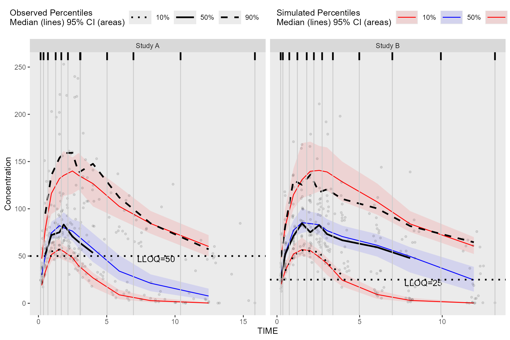

#### Plot rectangles using `bininfo()`

The results from
[`bininfo()`](https://github.com/certara/tidyvpc/reference/bininfo.md)
make it easy to plot a rectangle VPC using `ggplot2`.

``` r

vpc <- observed(obs_data, x=TIME, y=DV) %>%
    simulated(sim_data, y=DV) %>%
    binning(bin = "jenks", nbins = 4) %>%
    vpcstats()

#Get vpcstats df
stats <- vpc$stats
#Get bininfo df
bin_information <- bininfo(vpc)
#Left join bin_info to vpcstats on bin
bin_information <- stats[bin_information, on = "bin"]
#Generate ymin
bin_information <- bin_information[, ymin := min(y), by = "bin"]
#Generate ymax
bin_information <- bin_information[, ymax := max(y), by = "bin"]
head(bin_information)
#> Key: <xbin>
#>             bin      xbin  qname      y        lo       md        hi  nobs
#>          <fctr>     <num> <fctr>  <num>     <num>    <num>     <num> <int>
#> 1: [0.158,1.89) 0.8418133  q0.05  22.94  19.58905  22.7307  27.73307   213
#> 2: [0.158,1.89) 0.8418133   q0.5  61.50  57.45770  61.7670  67.05757   213
#> 3: [0.158,1.89) 0.8418133  q0.95 144.40 121.90995 132.7460 149.47290   213
#> 4:  [1.89,4.83) 2.8021930  q0.05  29.38  21.34827  28.0135  32.11742   187
#> 5:  [1.89,4.83) 2.8021930   q0.5  74.10  70.76337  76.1745  82.59877   187
#> 6:  [1.89,4.83) 2.8021930  q0.95 179.00 141.91740 157.6140 181.46822   187
#>      xmedian     xmean      xmin     xmax     xmid     xleft   xright  xcenter
#>        <num>     <num>     <num>    <num>    <num>     <num>    <num>    <num>
#> 1: 0.8418133 0.8717959 0.1575342 1.860852 1.009193 0.1575342 1.872980 1.015257
#> 2: 0.8418133 0.8717959 0.1575342 1.860852 1.009193 0.1575342 1.872980 1.015257
#> 3: 0.8418133 0.8717959 0.1575342 1.860852 1.009193 0.1575342 1.872980 1.015257
#> 4: 2.8021930 2.9458444 1.8851078 4.772347 3.328727 1.8729798 4.800346 3.336663
#> 5: 2.8021930 2.9458444 1.8851078 4.772347 3.328727 1.8729798 4.800346 3.336663
#> 6: 2.8021930 2.9458444 1.8851078 4.772347 3.328727 1.8729798 4.800346 3.336663
#>     ymin  ymax
#>    <num> <num>
#> 1: 22.94 144.4
#> 2: 22.94 144.4
#> 3: 22.94 144.4
#> 4: 29.38 179.0
#> 5: 29.38 179.0
#> 6: 29.38 179.0
```

Plot rectangles using `ymin` and `ymax`, the min/max y values in
`vpc$stats` grouped by bin.

``` r

ggplot(bin_information, aes(x = xbin)) + 
  geom_line(aes(y = md, col = qname, group = qname)) +
  geom_line(aes(y = y, linetype = qname), size = 1) +
  geom_rect(aes(xmin= xleft,xmax= xright, ymin =  ymin, ymax =  ymax),alpha = .1, col = "black", fill = "green") +
  geom_point(data = vpc$obs, aes(x = x, y = y), size = 1, alpha = 0.1, show.legend = FALSE) + 
  scale_colour_manual(name = "Simulated Percentiles\nMedian (lines) 95% CI (areas)",
                    breaks = c("q0.05", "q0.5", "q0.95"), 
                    values = c("red", "blue", "red"), 
                    labels = c("5%", "50%", "95%")) + 
  scale_linetype_manual(name = "Observed Percentiles\nMedian (lines) 95% CI (areas)", 
                    breaks = c("q0.05", "q0.5", "q0.95"), 
                    values = c("dotted", "solid", "dashed"), 
                    labels = c("5%", "50%", "95%")) + 
  geom_vline(data = bin_information[, .(x = sort(unique(c(xleft, xright))))],aes(xintercept = x), size = rel(0.5), col = "gray80") +
  geom_rug(data = bin_information[, .(x = sort(unique(c(xleft, xright))))],aes(x = x), sides = "t", size = 1) +
  guides(fill = guide_legend(order = 2), colour = guide_legend(order = 2), linetype = guide_legend(order = 1)) + 
  theme(legend.position = "top", legend.key.width = grid::unit(1, "cm")) + 
  labs(x = "TIME", y = "Concentration")
```

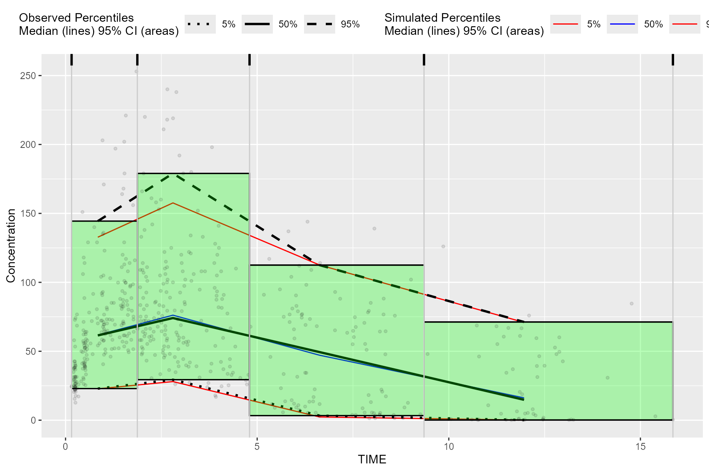

Alternatively, we can obtain the required data for plotting used in the
above `bin_information` data frame by merging `vpc$stats` and
`bininfo(vpc)` on `bin` in the `ggplot2` data argument. If stratifying,
you will need to include the name of the stratification variable(s) in
the `data.table` merge (e.g.,
`vpc$stats[bininfo(vpc), on=c("STUDY", "bin")]`). In the rectangle VPC
below, we will stratify on `STUDY` and plot rectangles for each
quantile.

``` r

obs_data$LLOQ <- obs_data[, ifelse(STUDY == "Study A", 50, 25)]

vpc <- observed(obs_data, x = TIME, y = DV) %>%
  simulated(sim_data, y = DV) %>%
  censoring(blq = DV < LLOQ, lloq = LLOQ) %>%
  stratify(~STUDY) %>%
  binning(bin = NTIME) %>%
  vpcstats(qpred = c(0.1, 0.5, 0.9))


ggplot(vpc$stats[bininfo(vpc), on=c("STUDY", "bin")], aes(x = xbin)) + 
  facet_grid(~STUDY, scales = "free", as.table = FALSE) + 
  geom_rect(aes(xmin = xleft, xmax = xright, ymin = lo, ymax = hi, fill = qname, col = qname, group = qname),alpha = 0.1, col = NA) + 
  geom_segment(aes(x = xleft, xend = xright, y = md, yend = md, col = qname, group = qname)) +
  geom_segment(aes(x = xleft, xend = xright, y = y, yend = y, linetype = qname), size = 1) +
  geom_line(aes(y = md, col = qname, group = qname)) +
  geom_line(aes(y = y, linetype = qname), size = 1) + 
  geom_hline(data=unique(obs_data[, .(STUDY, LLOQ)]), aes(yintercept=LLOQ), linetype="dotted", size=1) +
  geom_text(data = unique(vpc$data[, .(LLOQ), by = "STUDY"]), 
            aes(x = 10, y = LLOQ, label = paste("LLOQ", LLOQ, sep = "="), ), vjust = 1, hjust = 1) +
  scale_colour_manual(name = "Simulated Percentiles\nMedian (lines) 95% CI (areas)",
                      breaks = c("q0.1", "q0.5", "q0.9"), 
                      values = c("red", "blue", "red"), 
                      labels = c("10%", "50%", "90%")) + 
  scale_fill_manual(name = "Simulated Percentiles\nMedian (lines) 95% CI (areas)", 
                    breaks = c("q0.1", "q0.5", "q0.9"), 
                    values = c("red", "blue", "red"), 
                    labels = c("10%", "50%", "90%")) + 
  scale_linetype_manual(name = "Observed Percentiles\nMedian (lines) 95% CI (areas)", 
                        breaks = c("q0.1", "q0.5", "q0.9"), 
                        values = c("dotted", "solid", "dashed"), 
                        labels = c("10%", "50%", "90%")) + 
  guides(fill = guide_legend(order = 2), colour = guide_legend(order = 2), linetype = guide_legend(order = 1)) + 
  theme(legend.position = "top", legend.key.width = grid::unit(1, "cm")) + 
  labs(x = "TIME", y = "Concentration") + 
  geom_point(data = vpc$obs, aes(x = x, y = y), size = 1, alpha = 0.1, show.legend = FALSE) + 
  geom_vline(data = bininfo(vpc)[, .(x = sort(unique(c(xleft, xright)))), by = names(vpc$strat)],aes(xintercept = x), size = rel(0.5), col = "gray80") + 
  theme(panel.grid = element_blank()) + 
  geom_rug(data = bininfo(vpc)[, .(x = sort(unique(c(xleft, xright)))), by = names(vpc$strat)],aes(x = x), sides = "t", size = 1)
#> Warning: Removed 18 rows containing missing values or values outside the scale range
#> (`geom_segment()`).
#> Warning: Removed 18 rows containing missing values or values outside the scale range
#> (`geom_line()`).
```

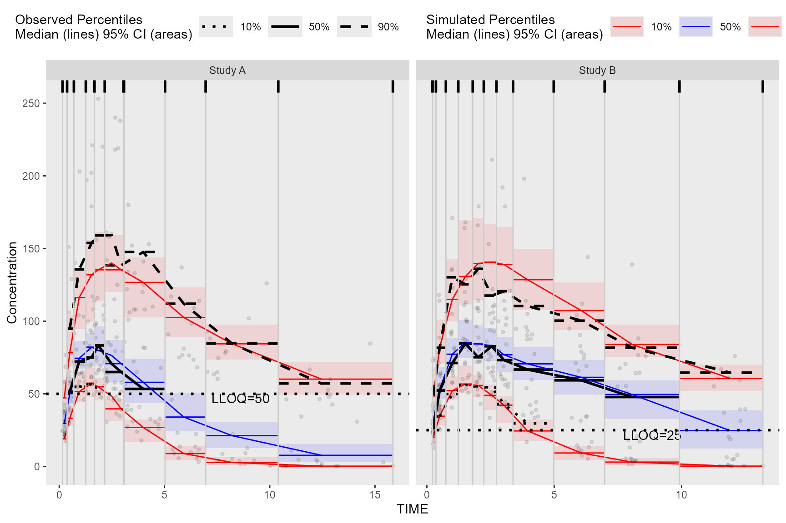

#### Plot Below Quantification Limit (BQL)

If using the
[`censoring()`](https://github.com/certara/tidyvpc/reference/censoring.md)
function, the resulting `tidyvpcobj` will also contain a pctblq table.
Use `ggplot2` to plot the percentage of data below the limit of
quantification across bins.

We can include
[`geom_ribbon()`](https://ggplot2.tidyverse.org/reference/geom_ribbon.html)
using the `lo` and `hi` columns in the `vpc$pctblq` table to denote the
lower/upper bounds of our confidence interval. Let’s also plot the
median %blq of the simulated data using the `md` column in the
`vpc$pctblq` table.

``` r

obs_data$LLOQ <- obs_data[, ifelse(STUDY == "Study A", 50, 25)]

vpc <- observed(obs_data, x = TIME, y = DV) %>%
  simulated(sim_data, y = DV) %>%
  censoring(blq = DV < LLOQ, lloq = LLOQ) %>%
  stratify(~STUDY) %>%
  binning(bin = NTIME) %>%
  vpcstats(qpred = c(0.1, 0.5, 0.9))

ggplot(vpc$pctblq) + 
  facet_grid(~STUDY) +
  geom_ribbon(aes(x = xbin, ymin= lo, ymax = hi), fill = "red", alpha = .2) + 
  geom_line(aes(x = xbin, y = y)) + 
  geom_line(aes(x = xbin, y = md), color = "red") + 
  labs(x= "TIME", y= "% BLQ")
```

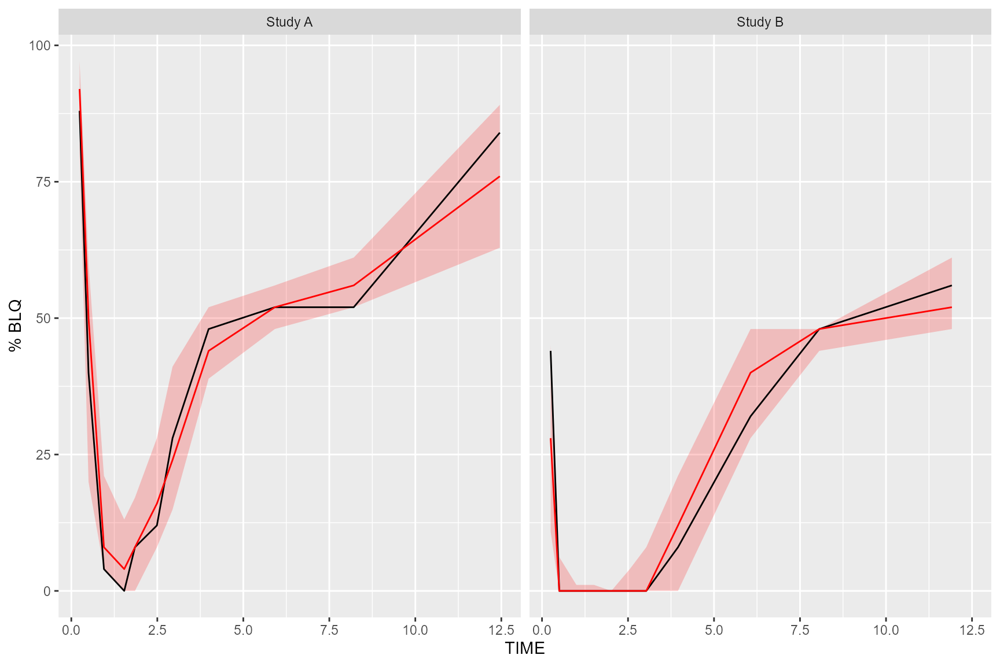
