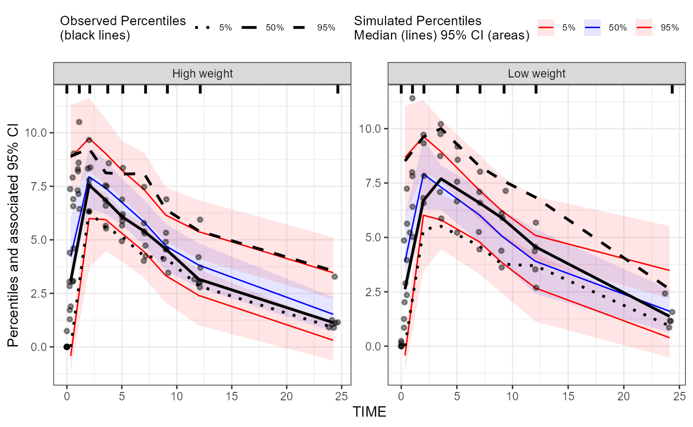
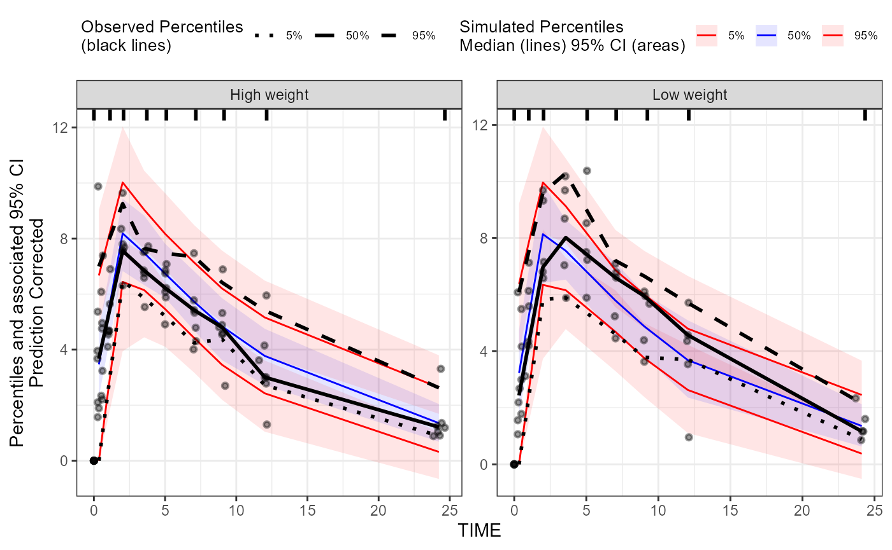

# tidyvpc with nlmixr2

## Introduction

`tidyvpc` and `nlmixr2` can work together seamlessly. The information
below will provide step-by-step methods for using `tidyvpc` to create
visual predictive checks (VPCs) for `nlmixr2` models.

## Setup

### R setup

First, you must load both libraries.

``` r

suppressPackageStartupMessages(library(tidyvpc, quietly = TRUE))
suppressPackageStartupMessages(library(nlmixr2, quietly = TRUE))
library(magrittr)
```

### Model fitting

Second, we will fit a simple model to use as an example. For more
information on using `nlmixr2` for model fitting, see the [nlmixr2
website](https://nlmixr2.org/).

``` r

one_compartment <- function() {
  ini({
    tka <- log(1.57); label("Ka")
    tcl <- log(2.72); label("Cl")
    tv <- log(31.5); label("V")
    eta_ka ~ 0.6
    eta_cl ~ 0.3
    eta_v ~ 0.1
    add_sd <- 0.7
  })
  # and a model block with the error specification and model specification
  model({
    ka <- exp(tka + eta_ka)
    cl <- exp(tcl + eta_cl)
    v <- exp(tv + eta_v)
    d/dt(depot) <- -ka * depot
    d/dt(center) <- ka * depot - cl / v * center
    cp <- center / v
    cp ~ add(add_sd)
  })
}

data_model <- theo_sd
data_model$WTSTRATA <- ifelse(data_model$WT < median(data_model$WT), "Low weight", "High weight")

fit <- nlmixr2(one_compartment, data_model, est="saem", saemControl(print=0))
#> ℹ parameter labels from comments are typically ignored in non-interactive mode
#> ℹ Need to run with the source intact to parse comments
#> → loading into symengine environment...
#> → pruning branches (`if`/`else`) of saem model...
#> ✔ done
#> → finding duplicate expressions in saem model...
#> [====|====|====|====|====|====|====|====|====|====] 0:00:00
#> → optimizing duplicate expressions in saem model...
#> [====|====|====|====|====|====|====|====|====|====] 0:00:00
#> ✔ done
#> ℹ calculate uninformed etas
#> ℹ done
#> Calculating covariance matrix
#> → loading into symengine environment...
#> → pruning branches (`if`/`else`) of saem model...
#> ✔ done
#> → finding duplicate expressions in saem predOnly model 0...
#> → finding duplicate expressions in saem predOnly model 1...
#> → optimizing duplicate expressions in saem predOnly model 1...
#> → finding duplicate expressions in saem predOnly model 2...
#> ✔ done
#> → Calculating residuals/tables
#> ✔ done
#> → compress origData in nlmixr2 object, save 7912
#> → compress parHistData in nlmixr2 object, save 8216
#> → compress phiM in nlmixr2 object, save 312032
```

### VPC preparation

`nlmixr2` provides a method for simulating multiple studies to prepare
for a VPC. Use the `keep` argument to add columns from the source data
to the simulated output (e.g. to use it for stratification of the VPC).

``` r

fit_vpcsim <- vpcSim(object = fit, keep = "WTSTRATA")
```

Following the `vpcSim()` call, the remainder of the steps use `tidyvpc`
to generate the vpc.

### Generate a standard VPC

The `x` and `y` arguments to
[`observed()`](https://github.com/certara/tidyvpc/reference/observed.md)
are the columns from your original dataset. The `x` and `y` arguments to
[`simulated()`](https://github.com/certara/tidyvpc/reference/simulated.md)
will almost always be `time` and `sim` based on the outut from
`vpcSim()`.

``` r

obs_data <- data_model[data_model$EVID == 0,]

vpc <-
  observed(obs_data, x=TIME, y=DV) %>%
  simulated(fit_vpcsim, x=time, y=sim) %>%
  stratify(~ WTSTRATA) %>%
  binning(bin = "jenks") %>%
  vpcstats()
```

``` r

plot(vpc)
```



### Prediction-corrected VPC

For a pred-corrected VPC, you need the population predicted value in the
observed data. That is straight-forward to add with `nlmixr2` by adding
the predictions to all rows with `EVID == 0`.

``` r

# Add PRED to observed data
data_pred <- data_model[data_model$EVID == 0, ]
data_pred$PRED <- fit$PRED

vpc_predcorr <-
  observed(data_pred, x=TIME, y=DV) %>%
  simulated(fit_vpcsim, x=time, y=sim) %>%
  stratify(~ WTSTRATA) %>%
  binning(bin = "jenks") %>%
  predcorrect(pred=PRED) %>%
  vpcstats()
```

``` r

plot(vpc_predcorr)
```


