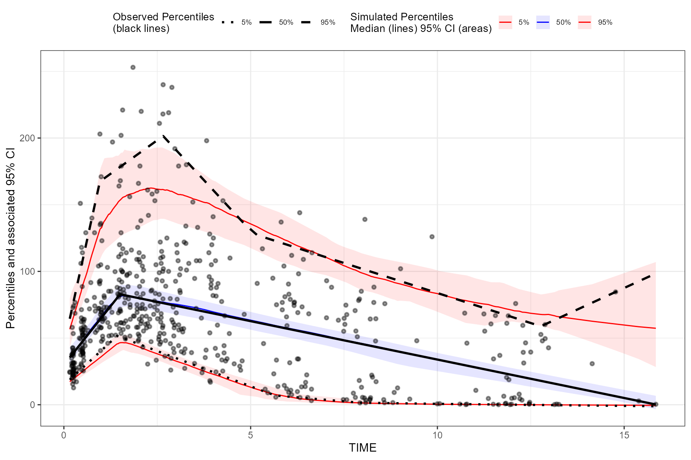
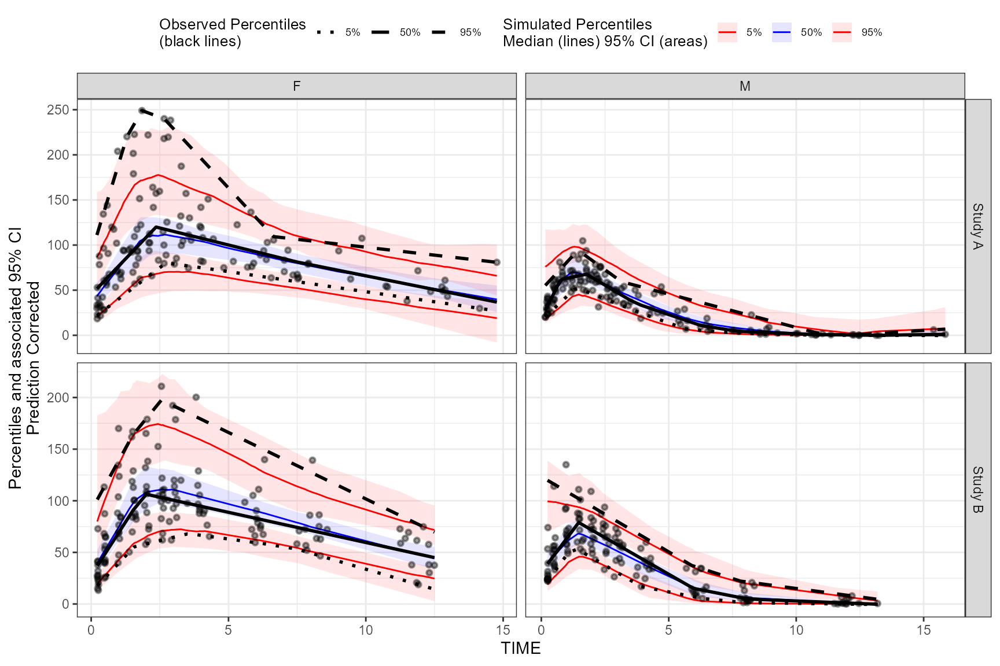
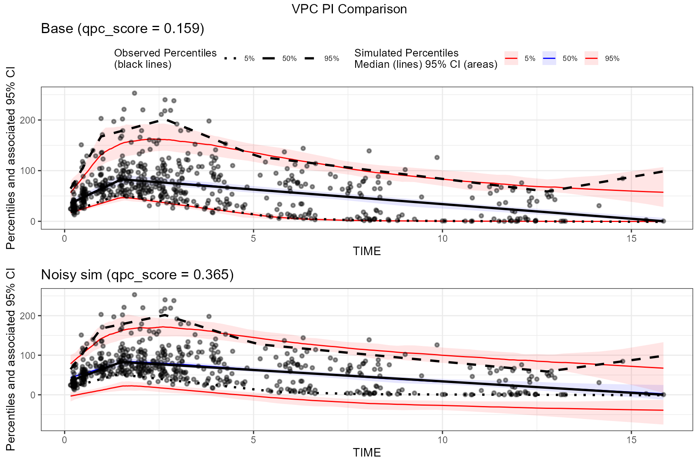

# Quantitative Predictive Check (QPC) scoring for VPC

## Introduction

A Visual Predictive Check (VPC) is typically assessed visually by
checking:

- calibration (are observations inside simulated prediction intervals?)
- bias and trend (does the model systematically miss in certain x
  regions?)
- sharpness (are prediction intervals unnecessarily wide?)

The **Quantitative Predictive Check (QPC)** score in `tidyvpc` is a
*numeric* summary of these features, computed from an existing
`tidyvpcobj` after
[`vpcstats()`](https://github.com/certara/tidyvpc/reference/vpcstats.md).

QPC produces a table `qpc.stats` and a composite scalar **`qpc_score`**
(**lower is better**) that can be used for automated model comparison
and optimization.

## What QPC measures (methodology overview)

QPC is computed from `o$stats` (the `data.table` produced by
[`vpcstats()`](https://github.com/certara/tidyvpc/reference/vpcstats.md)),
which contains (for continuous VPCs) curve points across quantiles:

- `qname`: quantile curve (e.g. `q0.05`, `q0.5`, `q0.95`)
- `y`: observed curve value at x
- `md`: simulated median curve at x
- `lo`, `hi`: simulated confidence interval bounds at x for that
  quantile curve

At each curve point, QPC derives:

- **Coverage**: whether $`y \in [lo, hi]`$
- **Deviation**: $`|y - md|`$ relative to PI half-width
- **Drift**: Spearman correlation of residuals $`(y-md)`$ versus x
  (monotonic bias)
- **Sharpness**: interval width (penalizes “variance inflation”)
- **Proper interval score (Winkler)**: rewards narrow intervals but
  penalizes misses

These are aggregated across curves and combined into `qpc_score` with
user-controlled weights.

### Penalties (what is printed)

[`qpcstats()`](https://github.com/certara/tidyvpc/reference/qpcstats.md)
prints a scalar `qpc_score` plus a component breakdown. Each component
is designed to be **0 = best** and larger values = worse.

At a high level:

- **Coverage penalties** measure calibration (are observed curves inside
  simulated uncertainty bands?).
- **MAE and drift penalties** measure agreement and bias structure (how
  far and whether the residuals trend with x).
- **Sharpness and interval penalties** discourage “variance inflation”
  (overly wide bands that can artificially increase coverage).

More concretely (continuous VPC):

- **Median coverage penalty** (`coverage_penalty_med`): computed from
  the median quantile curve (the curve closest to $`q=0.5`$):
  ``` math
  1 - \text{mean}(\mathbf{1}[y \in [lo,hi]])
  ```
  Lower is better; 0 means the observed median curve is always inside
  the simulated band.

- **Tail coverage penalty** (`coverage_penalty_tails`): computed from
  the lowest and highest quantile curves available (typically $`q=0.05`$
  and $`q=0.95`$), averaged:
  ``` math
  \frac{(1-\text{coverage}_{low}) + (1-\text{coverage}_{high})}{2}
  ```

- **MAE penalty** (`mae_penalty_all`): based on deviation scaled by PI
  half-width:
  ``` math
  dev\_mid = \frac{|y-md|}{(hi-lo)/2}
  ```
  then bounded to $`[0,1]`$ and averaged across curves. This highlights
  “large misses relative to the model’s own uncertainty”.

- **Drift penalty** (`rho_penalty_all`): absolute Spearman correlation
  of residuals $`(y-md)`$ vs x (averaged across curves), bounded to
  $`[0,1]`$. Values near 0 indicate no monotonic bias trend across x;
  larger values indicate systematic drift.

- **Sharpness penalty** (`sharpness_penalty`): penalizes wide bands
  using relative width:
  ``` math
  width\_{rel} = \frac{(hi-lo)}{|md|}
  ```
  By default (single-VPC scoring), this is mapped to $`[0,1)`$ with a
  bounded transform:
  ``` math
  1 - e^{-\max(width\_{rel}, 0)}
  ```
  Optionally, you can anchor this with `sharp_ref` for cross-model
  comparability.

- **Interval penalty** (`interval_penalty`): based on the Winkler
  interval score for nominal PI level $`(1-\alpha)`$: \$\$ IS =
  (hi-lo) + \\frac{2}{\\alpha}(lo-y)\\mathbf{1}\[y\<lo\] +
  \\frac{2}{\\alpha}(y-hi)\\mathbf{1}\[y\>hi\] \$\$ This rewards narrow
  intervals but strongly penalizes misses. By default we apply a bounded
  transform to a normalized score; optionally you can anchor with
  `interval_ref`.

Finally:

``` math
qpc\_score = \sum_i w_i \cdot penalty_i
```

where `w` is the named weight vector (`med_cov`, `tail_cov`, `mae`,
`drift`, `sharp`, `interval`).

## Data

We’ll use the built-in
[`tidyvpc::obs_data`](https://github.com/certara/tidyvpc/reference/obs_data.md)
and
[`tidyvpc::sim_data`](https://github.com/certara/tidyvpc/reference/sim_data.md)
and follow the standard preprocessing used throughout our vignettes.

``` r

obs_data <- as.data.table(tidyvpc::obs_data)
sim_data <- as.data.table(tidyvpc::sim_data)

obs_data <- obs_data[MDV == 0]
sim_data <- sim_data[MDV == 0]
```

Add the population prediction `PRED` (from replicate 1) into the
observed data for pcVPC examples:

``` r

obs_data$PRED <- sim_data[REP == 1, PRED]
```

## Example 1: Basic QPC scoring

Below is a standard continuous VPC using binless VPC stats. The QPC
computation is a post-processing step after
[`vpcstats()`](https://github.com/certara/tidyvpc/reference/vpcstats.md).

``` r

vpc <- observed(obs_data, x = TIME, y = DV) %>%
  simulated(sim_data, y = DV) %>%
  binless() %>%
  vpcstats()

vpc <- qpcstats(vpc)

print(vpc)
#> VPC with 100 replicates 
#> Stratified by:  
#> QPC: qpc_score = 0.159 (lower is better)
#> Breakdown (0 = best):
#>   median coverage penalty  0.000
#>   tail coverage penalty    0.092
#>   MAE penalty              0.221
#>   drift penalty            0.409
#>   sharpness penalty        0.272
#>   interval penalty         0.391
#> 
#>                x  qname         y        md        lo        hi
#>            <num> <fctr>     <num>     <num>     <num>     <num>
#>    1:  0.2157624  q0.05  20.27050  18.70099  15.46726  22.76529
#>    2:  0.4694366  q0.05  26.85172  24.20164  20.90806  28.69981
#>    3:  0.8271844  q0.05  36.13299  32.25889  27.80422  37.28306
#>    4:  1.7724895  q0.05  47.97810  45.68455  39.37618  51.15900
#>    5:  1.7142415  q0.05  48.59415  46.13059  39.92622  51.83491
#>   ---                                                          
#> 1646:  3.1146520  q0.95 187.64868 157.66057 135.21747 185.70608
#> 1647:  3.9526689  q0.95 162.26683 149.76519 128.25975 168.88196
#> 1648:  6.0247591  q0.95 119.55945 122.36560 105.29532 140.59213
#> 1649:  7.7967326  q0.95 103.60993 101.08928  88.41343 115.52899
#> 1650: 12.2981243  q0.95  63.09294  69.37852  61.51805  85.95328
```

The composite score is available in `qpc.stats$qpc_score` (for
stratified VPCs you will also see an `qpc_scope == "overall"` row).

Plot the VPC:

``` r

plot(vpc)
```



## Example 2: QPC with prediction correction and stratification

QPC relies on `vpc$stats`, so it naturally works with prediction
correction and stratification (for continuous VPCs).

``` r

vpc_pc_strat <- observed(obs_data, x = TIME, y = DV) %>%
  simulated(sim_data, y = DV) %>%
  stratify(STUDY ~ GENDER) %>%
  predcorrect(pred = PRED) %>%
  binless() %>%
  vpcstats()

vpc_pc_strat <- qpcstats(vpc_pc_strat)
print(vpc_pc_strat)
#> Prediction corrected VPC with 100 replicates 
#> Stratified by: STUDY, GENDER 
#> QPC: qpc_score = 0.148 (lower is better)
#> Breakdown (0 = best):
#>   median coverage penalty  0.009
#>   tail coverage penalty    0.037
#>   MAE penalty              0.201
#>   drift penalty            0.078
#>   sharpness penalty        0.453
#>   interval penalty         0.542
#> 
#> QPC qpc_score by stratum:
#>      STUDY  GENDER qpc_score qpc_scope
#>     <char>  <char>     <num>    <char>
#> 1: Study A       F 0.2185022   stratum
#> 2: Study B       F 0.1143301   stratum
#> 3: Study A       M 0.1760193   stratum
#> 4: Study B       M 0.1995141   stratum
#> 5: __ALL__ __ALL__ 0.1481005   overall
#>                x  qname   STUDY GENDER         y        md        lo       hi
#>            <num> <fctr>  <char> <char>     <num>     <num>     <num>    <num>
#>    1:  0.2414537  q0.05 Study A      F 22.628106 21.603303 14.635225 29.01338
#>    2:  0.6153070  q0.05 Study A      F 31.298883 31.217977 22.157131 43.88344
#>    3:  0.7493947  q0.05 Study A      F 34.408780 34.786598 25.021506 49.07117
#>    4:  1.6711424  q0.05 Study A      F 55.786869 59.999193 39.790871 82.52384
#>    5:  2.2418821  q0.05 Study A      F 69.024031 66.798270 45.272725 93.57229
#>   ---                                                                        
#> 1646:  2.9649190  q0.95 Study B      M 80.150799 75.984410 61.464186 97.94624
#> 1647:  4.2881855  q0.95 Study B      M 60.858937 58.079728 43.476314 75.06576
#> 1648:  6.0457983  q0.95 Study B      M 36.202388 34.662559 21.504472 51.58254
#> 1649:  7.9075620  q0.95 Study B      M 21.905414 20.454721 11.120393 34.17353
#> 1650: 12.0612380  q0.95 Study B      M  8.275706  6.636687  2.630895 14.68703
```

Plot the stratified pcVPC:

``` r

plot(vpc_pc_strat)
```



### Interpreting differences between `vpc` and `vpc_pc_strat`

In the vignette examples you printed:

- The **prediction-corrected + stratified** VPC (`vpc_pc_strat`) shows a
  **lower drift penalty** (residuals trend less with x), because
  prediction correction and stratification often remove structured bias
  that would otherwise appear as monotonic drift.
- At the same time, `vpc_pc_strat` can show **higher sharpness/interval
  penalties** if the simulated uncertainty bands are wider within strata
  (or if prediction correction changes the scale/structure of
  residuals), because QPC explicitly penalizes overly wide intervals
  even when they improve coverage.
- The **per-stratum qpc_score table** helps localize which
  subpopulations drive the overall score: strata with worse calibration
  (coverage penalties) or wider uncertainty (sharpness/interval
  penalties) will typically have higher `qpc_score`.

## Example 3: QPC scoring with traditional binning()

QPC works with traditional binned VPCs as well (it scores directly from
`vpc$stats`). The only difference is that
[`vpcstats()`](https://github.com/certara/tidyvpc/reference/vpcstats.md)
will compute summaries at `xbin` instead of `x`.

``` r

vpc_binned <- observed(obs_data, x = TIME, y = DV) %>%
  simulated(sim_data, y = DV) %>%
  binning(bin = NTIME) %>%
  vpcstats()

vpc_binned <- qpcstats(vpc_binned)

print(vpc_binned)
#> VPC with 100 replicates 
#> Stratified by:  
#> QPC: qpc_score = 0.149 (lower is better)
#> Breakdown (0 = best):
#>   median coverage penalty  0.000
#>   tail coverage penalty    0.091
#>   MAE penalty              0.199
#>   drift penalty            0.276
#>   sharpness penalty        0.311
#>   interval penalty         0.428
#> 
#> Key: <xbin>
#>        bin       xbin  qname       y          lo          md          hi
#>     <fctr>      <num> <fctr>   <num>       <num>       <num>       <num>
#>  1:   0.25  0.2490835  q0.05 17.4250 13.20370500 16.63365000  20.0638487
#>  2:   0.25  0.2490835   q0.5 28.1000 26.33373750 30.44625000  36.4071750
#>  3:   0.25  0.2490835  q0.95 70.9100 47.45008250 55.05687500  71.2563250
#>  4:    0.5  0.5009004  q0.05 28.9200 24.25121000 29.00000000  35.0677837
#>  5:    0.5  0.5009004   q0.5 51.8000 46.10241250 51.90550000  60.0179125
#> ---                                                                     
#> 29:      8  8.0691507   q0.5 35.0000 24.03068750 33.87400000  42.8817250
#> 30:      8  8.0691507  q0.95 95.7900 83.68695000 96.48842500 110.8845750
#> 31:     12 12.0253628  q0.05  0.1291  0.02170331  0.08714695   0.2521808
#> 32:     12 12.0253628   q0.5 13.3750  7.52458375 15.91905000  24.0568625
#> 33:     12 12.0253628  q0.95 67.5600 59.34408250 68.91725000  82.5615012
```

## Example 4: Noisy simulations → wider confidence intervals → worse QPC

One failure mode of purely visual scoring is that *very wide* simulated
confidence intervals can appear to “cover everything”. QPC penalizes
this via **sharpness** and **interval score** components.

Here we artificially add noise to the simulated DV values to create
wider confidence intervals, then compare `qpc.stats`.

``` r

sim_data_noisy <- copy(sim_data)

# Increase variability of simulated DV values; this should widen lo/hi bands.
sim_data_noisy[, DV := DV + rnorm(.N, mean = 0, sd = 25)]

vpc_base <- observed(obs_data, x = TIME, y = DV) %>%
  simulated(sim_data, y = DV) %>%
  binless() %>%
  vpcstats() %>%
  qpcstats()

vpc_noisy <- observed(obs_data, x = TIME, y = DV) %>%
  simulated(sim_data_noisy, y = DV) %>%
  binless() %>%
  vpcstats() %>%
  qpcstats()

base_overall <- vpc_base$qpc.stats[qpc_scope == "overall"]
noisy_overall <- vpc_noisy$qpc.stats[qpc_scope == "overall"]

cmp <- rbindlist(list(
  cbind(data.table(case = "base"), base_overall),
  cbind(data.table(case = "noisy_sim"), noisy_overall)
), fill = TRUE)

cmp_summary <- cmp[, .(
  Case = case,
  `QPC score` = qpc_score,
  `Median coverage` = coverage_penalty_med,
  `Tail coverage` = coverage_penalty_tails,
  Sharpness = sharpness_penalty,
  Interval = interval_penalty
)]

cmp_summary[, (names(cmp_summary)[-1]) := lapply(.SD, \(x) round(x, 3)), .SDcols = names(cmp_summary)[-1]]
knitr::kable(cmp_summary, caption = "QPC summary: baseline vs noisy simulations (0 = best; lower qpc_score is better)")
```

| Case      | QPC score | Median coverage | Tail coverage | Sharpness | Interval |
|:----------|----------:|----------------:|--------------:|----------:|---------:|
| base      |     0.159 |               0 |         0.092 |     0.272 |    0.391 |
| noisy_sim |     0.365 |               0 |         0.588 |     0.304 |    0.966 |

QPC summary: baseline vs noisy simulations (0 = best; lower qpc_score is
better) {.table}

In this comparison you will typically see:

- **sharpness_penalty** increases with wider prediction intervals
- **interval_penalty** increases because the Winkler score increases
  with width (even if coverage improves)
- therefore **qpc_score** tends to increase (worse)

Compare the two plots:

``` r

    qpc_base <- vpc_base$qpc.stats[qpc_scope == "overall", qpc_score][1]
qpc_noisy <- vpc_noisy$qpc.stats[qpc_scope == "overall", qpc_score][1]

p_base <- plot(vpc_base) +
  ggplot2::ggtitle(sprintf("Base (qpc_score = %.3f)", qpc_base))

p_noisy <- plot(vpc_noisy) +
  ggplot2::theme(legend.position = "none") +
  ggplot2::ggtitle(sprintf("Noisy sim (qpc_score = %.3f)", qpc_noisy))

egg::ggarrange(p_base,
               p_noisy,
               nrow = 2, ncol = 1,
               top = "VPC PI Comparison"
)
```



## Tips for using `sharp_ref` and `interval_ref`

By default (`sharp_ref = NULL`, `interval_ref = NULL`), QPC uses
**self-normalizing bounded transforms** so you can score a single VPC
without external calibration.

If you are comparing *many* models (e.g. search/optimization) and need
more stable cross-run comparability, set:

- `sharp_ref`: a reference sharpness level (e.g. median across a model
  population)
- `interval_ref`: a reference interval-score level (e.g. median/75th
  percentile across models)

``` r

vpc <- qpcstats(vpc, sharp_ref = 0.15, interval_ref = 2.5)
```
