# What's New in tidyvpc?

## tidyvpc 1.6.0

### Quantitative Predictive Check (QPC)

The headline addition in `1.6.0` is the new
[`qpcstats()`](https://github.com/certara/tidyvpc/reference/qpcstats.md)
function, which computes a **Quantitative Predictive Check (QPC)** score
for continuous VPCs. Where a VPC is normally assessed by eye, QPC
produces a single numeric `qpc_score` (**lower is better**) that
summarizes calibration, bias/drift, and sharpness, making it
straightforward to compare or automatically optimize models.

QPC is a post-processing step applied to an existing `tidyvpcobj` after
[`vpcstats()`](https://github.com/certara/tidyvpc/reference/vpcstats.md).
The composite score is reported alongside component penalties (coverage,
MAE, drift, sharpness, and the Winkler interval score).

``` r

library(tidyvpc)
#> tidyvpc is part of Certara.R!
#> Follow the link below to learn more about PMx R package development at Certara.
#> https://certara.github.io/R-Certara/
obs_data <- obs_data[MDV == 0]
sim_data <- sim_data[MDV == 0]

vpc <- observed(obs_data, x = TIME, y = DV) |>
  simulated(sim_data, y = DV) |>
  binless() |>
  vpcstats() |>
  qpcstats()

print(vpc)
#> VPC with 100 replicates 
#> Stratified by:  
#> QPC: qpc_score = 0.159 (lower is better)
#> Breakdown (0 = best):
#>   median coverage penalty  0.000
#>   tail coverage penalty    0.092
#>   MAE penalty              0.221
#>   drift penalty            0.409
#>   sharpness penalty        0.272
#>   interval penalty         0.391
#> 
#>                x  qname         y        md        lo        hi
#>            <num> <fctr>     <num>     <num>     <num>     <num>
#>    1:  0.2157624  q0.05  20.27050  18.70099  15.46726  22.76529
#>    2:  0.4694366  q0.05  26.85172  24.20164  20.90806  28.69981
#>    3:  0.8271844  q0.05  36.13299  32.25889  27.80422  37.28306
#>    4:  1.7724895  q0.05  47.97810  45.68455  39.37618  51.15900
#>    5:  1.7142415  q0.05  48.59415  46.13059  39.92622  51.83491
#>   ---                                                          
#> 1646:  3.1146520  q0.95 187.64868 157.66057 135.21747 185.70608
#> 1647:  3.9526689  q0.95 162.26683 149.76519 128.25975 168.88196
#> 1648:  6.0247591  q0.95 119.55945 122.36560 105.29532 140.59213
#> 1649:  7.7967326  q0.95 103.60993 101.08928  88.41343 115.52899
#> 1650: 12.2981243  q0.95  63.09294  69.37852  61.51805  85.95328
```

QPC also works with
[`binning()`](https://github.com/certara/tidyvpc/reference/binning.md),
[`stratify()`](https://github.com/certara/tidyvpc/reference/stratify.md),
[`predcorrect()`](https://github.com/certara/tidyvpc/reference/predcorrect.md),
and
[`censoring()`](https://github.com/certara/tidyvpc/reference/censoring.md).
For the full methodology, weighting options, and worked examples, see
the dedicated vignette:
[`vignette("tidyvpc_qpc")`](https://github.com/certara/tidyvpc/articles/tidyvpc_qpc.md).

### Non-replicate simulated data support

`tidyvpc` now supports simulated data that is **not** a 1:1 replicate of
the observed data.
[`simulated()`](https://github.com/certara/tidyvpc/reference/simulated.md)
gains `xsim` and `repl` arguments (to supply the simulated x-values and
the replicate identifier), and
[`stratify()`](https://github.com/certara/tidyvpc/reference/stratify.md)
gains a `data.sim` argument so strata can be supplied directly for the
simulated data. Both
[`binning()`](https://github.com/certara/tidyvpc/reference/binning.md)
and
[`binless()`](https://github.com/certara/tidyvpc/reference/binless.md)
are supported, and the previous non-replicate hard errors are now
warnings. You can toggle `tidyvpc`-specific messages with
`options("tidyvpc.verbose" = TRUE)`.

In the example below we construct a “rich” (non-replicate) simulated
dataset by interpolating simulated `DV` onto a fine `TIME` grid per
`ID`/`REP`, then fit a non-replicate VPC.

``` r

library(data.table)
options("tidyvpc.verbose" = TRUE)

obs <- tidyvpc::obs_data[MDV == 0]
sim <- tidyvpc::sim_data[MDV == 0]
sim$GENDER <- rep(obs$GENDER, nrow(sim) / nrow(obs))

# Build a non-replicate ("rich") simulated dataset on a fine time grid
sim_rich <- sim[, {
  ntime_seq <- seq(from = min(TIME), to = max(TIME), by = 0.01)
  dv_interp <- approx(x = TIME, y = DV, xout = ntime_seq)$y
  data.table(TIME = ntime_seq, DV = dv_interp, GENDER = GENDER[1])
}, by = .(ID, REP)]

vpc_non_rep <- observed(obs, x = TIME, yobs = DV) |>
  simulated(sim_rich, xsim = TIME, ysim = DV, repl = REP) |>
  binning(bin = "jenks", nbins = 5) |>
  vpcstats()

plot(vpc_non_rep)
```

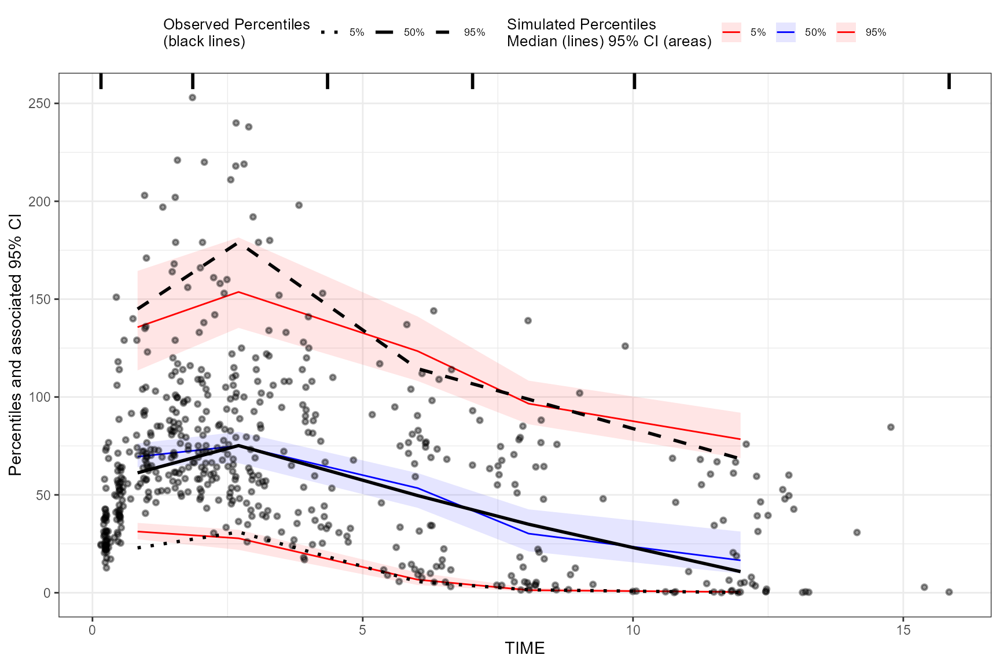

When the simulated data is not a replicate of the observed data, the
observed-data bins and strata are propagated to the simulated data.
Stratification on non-replicate simulated data uses the new `data.sim`
argument:

``` r

vpc_non_rep_strat <- observed(obs, x = TIME, yobs = DV) |>
  simulated(sim_rich, xsim = TIME, ysim = DV, repl = REP) |>
  stratify(~ GENDER, data.sim = sim_rich) |>
  binning(bin = "jenks", nbins = 5) |>
  vpcstats()

plot(vpc_non_rep_strat)
```

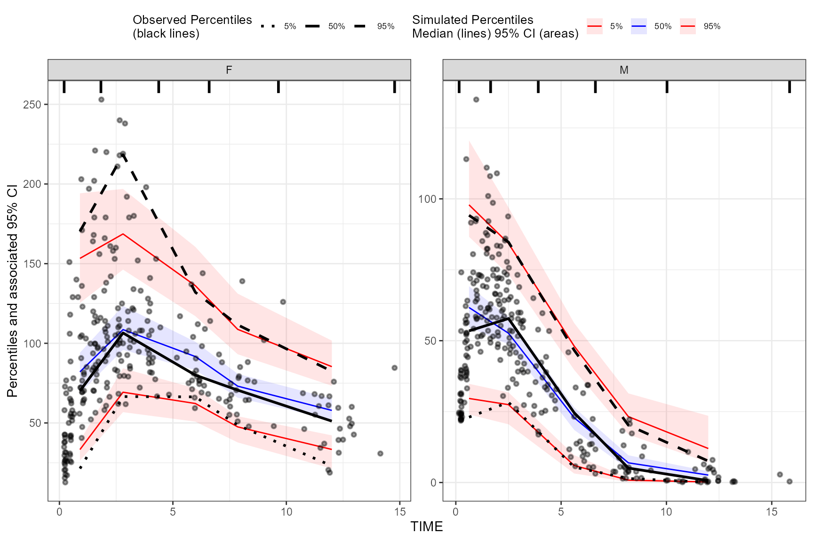

### Customize censoring (BLQ/ALQ) plot colors

[`plot.tidyvpcobj()`](https://github.com/certara/tidyvpc/reference/plot.tidyvpcobj.md)
gains `censoring.color` and `censoring.fill` arguments to customize the
colors used in the BLQ/ALQ percentage plots. `censoring.color` is a
named vector with `observed` and `simulated` entries (controlling the
line colors), while `censoring.fill` sets the ribbon fill color.

``` r

obs_data$LLOQ <- obs_data[, ifelse(STUDY == "Study A", 50, 25)]
obs_data$ULOQ <- obs_data[, ifelse(STUDY == "Study A", 125, 100)]

vpc_cens <- observed(obs_data, x = TIME, y = DV) |>
  simulated(sim_data, y = DV) |>
  censoring(blq = DV < LLOQ, lloq = LLOQ, alq = DV > ULOQ, uloq = ULOQ) |>
  stratify(~ STUDY) |>
  binning(bin = NTIME) |>
  vpcstats(qpred = c(0.1, 0.5, 0.9))

plot(vpc_cens, censoring.type = "blq", censoring.output = "grid",
     censoring.color = c(observed = "black", simulated = "blue"),
     censoring.fill = "blue")
```

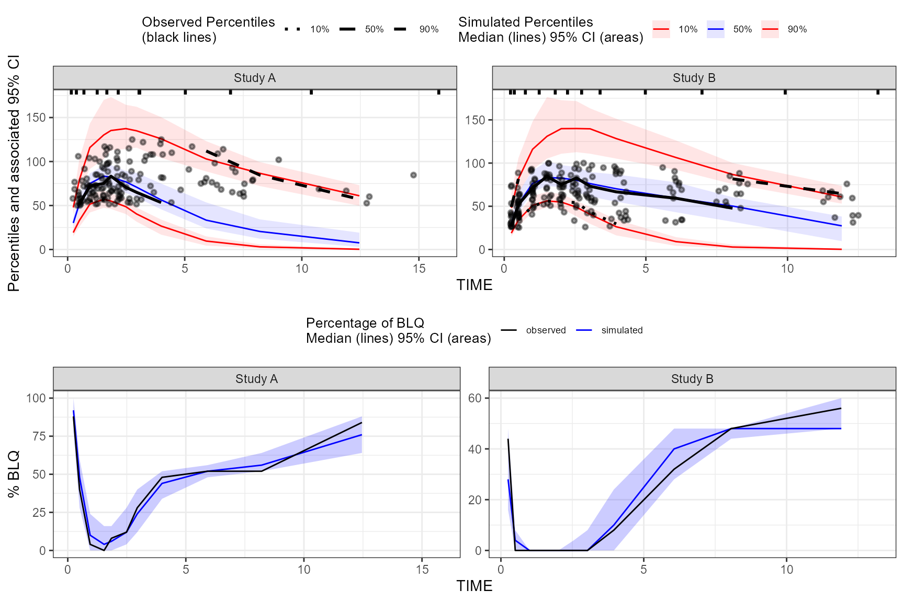

## tidyvpc 1.5.2

### Variability correction for prediction-corrected VPC (`varcorr`)

[`predcorrect()`](https://github.com/certara/tidyvpc/reference/predcorrect.md)
gains a `varcorr` logical argument (defaults to `FALSE`) that applies
variability correction to the prediction-corrected dependent variable.
When enabled, the correction adds a `ypcvc` column that is used for the
VPC summaries.

``` r

obs_data$PRED <- sim_data[REP == 1, PRED]

vpc <- observed(obs_data, x = TIME, y = DV) |>
  simulated(sim_data, y = DV) |>
  predcorrect(pred = PRED, varcorr = TRUE) |>
  binning(bin = NTIME) |>
  vpcstats()

plot(vpc)
```

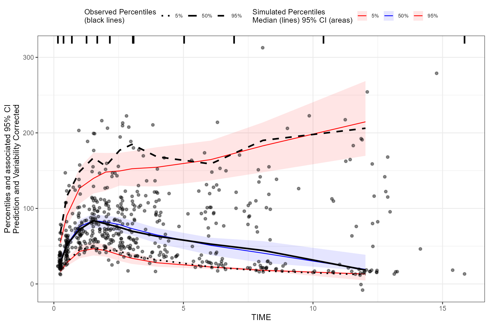

### NPDE computational workflow update

The computational workflow for Normalized Prediction Distribution Errors
(NPDE) was revised in `1.5.2` for improved correctness and consistency.
The public
[`npde()`](https://github.com/certara/tidyvpc/reference/npde.md)
interface is unchanged; see
[`?npde`](https://github.com/certara/tidyvpc/reference/npde.md) for
usage.

## tidyvpc 1.5.0

### Plot Percentage of BLQ and/or ALQ

For VPC with censoring, users can supply additional arguments to
`plot.tidyvpcobj` e.g., `censoring.type` (options are `'none'`, `'blq'`,
`'alq'`, or `'both'`, defaults to `'none'`) and `censoring.output`
(options are `'grid'` or `'list'`, defaults to `'grid'`).

If `censoring.output = 'grid'`, the plots will be arranged into single
grid plot. Users may pass additional arguments via ellipsis to
[`egg::ggarrange`](https://rdrr.io/pkg/egg/man/ggarrange.html) e.g.,
`nrow = 1`, `ncol = 2` in order to customize plots in grid arrangement.

If `censoring.output = 'list'`, the resulting plots will be returned
individually as elements in list.

Example usage is below:

``` r

library(tidyvpc)
obs_data <- obs_data[MDV == 0]
sim_data <- sim_data[MDV == 0]
obs_data$LLOQ <- obs_data[, ifelse(STUDY == "Study A", 50, 25)]
obs_data$ULOQ <- obs_data[, ifelse(STUDY == "Study A", 125, 100)]

vpc <- observed(obs_data, x = TIME, y = DV) |>
  simulated(sim_data, y = DV) |>
  censoring(blq = DV < LLOQ, lloq = LLOQ,  alq = DV > ULOQ, uloq = ULOQ) |>
  stratify(~ STUDY) |>
  binning(bin = NTIME) |>
  vpcstats(qpred = c(0.1, 0.5, 0.9))
```

If blq data, users may supply `censoring.type = "blq"`:

``` r

plot(vpc, censoring.type = "blq", censoring.output = "grid", facet.scales = "fixed")
```

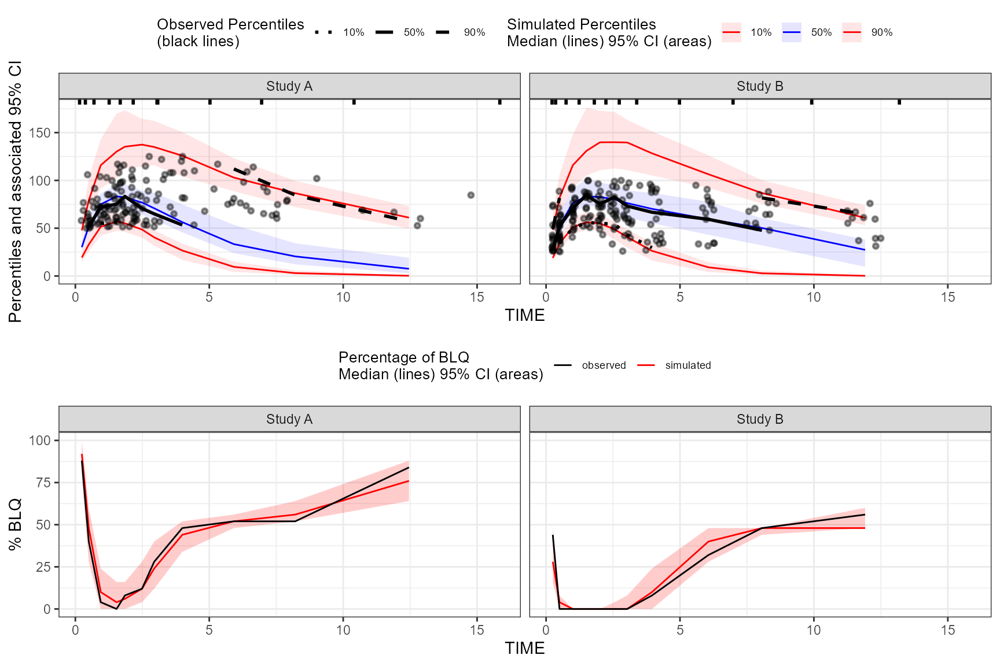

If alq data, users may supply `censoring.type = "alq"`:

``` r

plot(vpc, censoring.type = "alq", censoring.output = "grid", ncol = 2, nrow = 1)
```

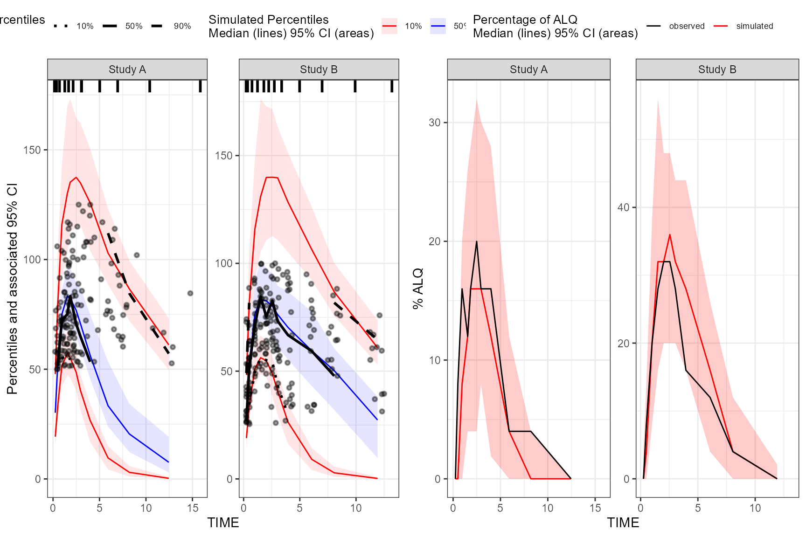

If both blq and alq data, users may supply `censoring.type = "both"`

``` r

vpc_plots <- plot(vpc, censoring.type = "both", censoring.output = "list")
```

By default, when `censoring.tidyvpcobj` is used, no percentage blq/alq
plots will be returned e.g., default for `censoring.type = 'none'`. If
users specify `censoring.type='both'` and only blq censoring was
performed, for example, they will receive an error stating e.g.,
`pctalq data.frame was not found in tidyvpcobj. Use censoring() to create censored data for plotting alq`.

## tidyvpc 1.4.0

### Additional Binning Methods

The following additional binning methods from `classInt` have been made
available in `tidyvpc`.

see `?classIntervals` ‘style’ descriptions for applicable arguments for
each selected binning method.

``` r

library(tidyvpc)
obs_data <- obs_data[MDV == 0]
sim_data <- sim_data[MDV == 0]
```

#### `headtails`

``` r

observed(obs_data, x = TIME, y = DV) |>
  simulated(sim_data, y = DV) |>
  binning(bin = "headtails") |>
  plot()
```

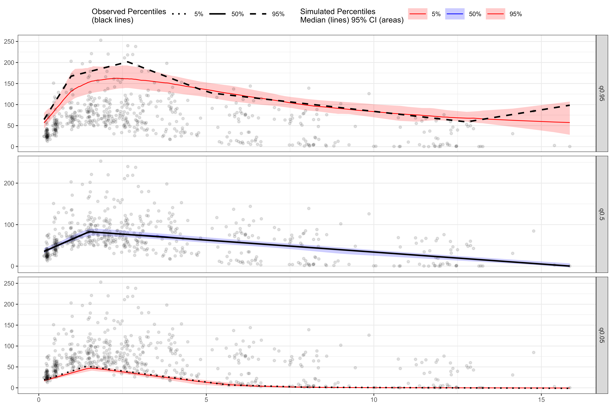

Including additional `thr` argument.

``` r

observed(obs_data, x = TIME, y = DV) |>
  simulated(sim_data, y = DV) |>
  binning(bin = "headtails", thr = 0.55) |>
  plot()
```

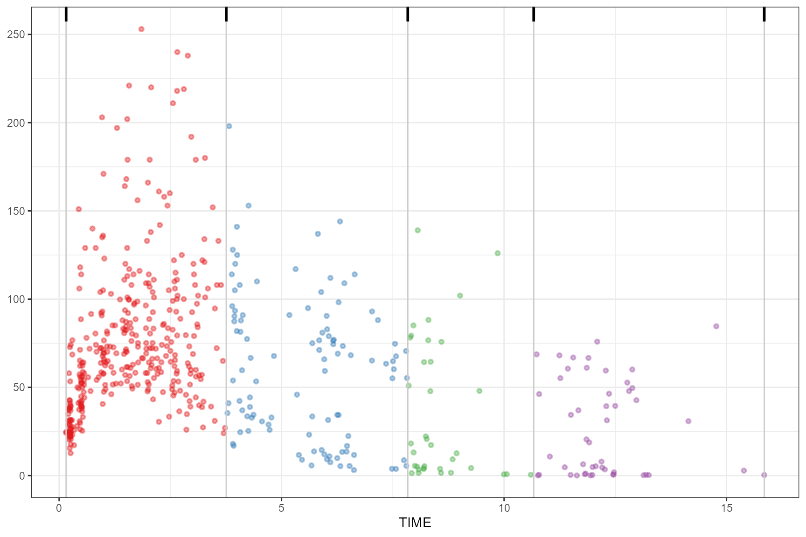

#### `maximum`

``` r

observed(obs_data, x = TIME, y = DV) |>
  simulated(sim_data, y = DV) |>
  binning(bin = "maximum") |>
  plot()
```

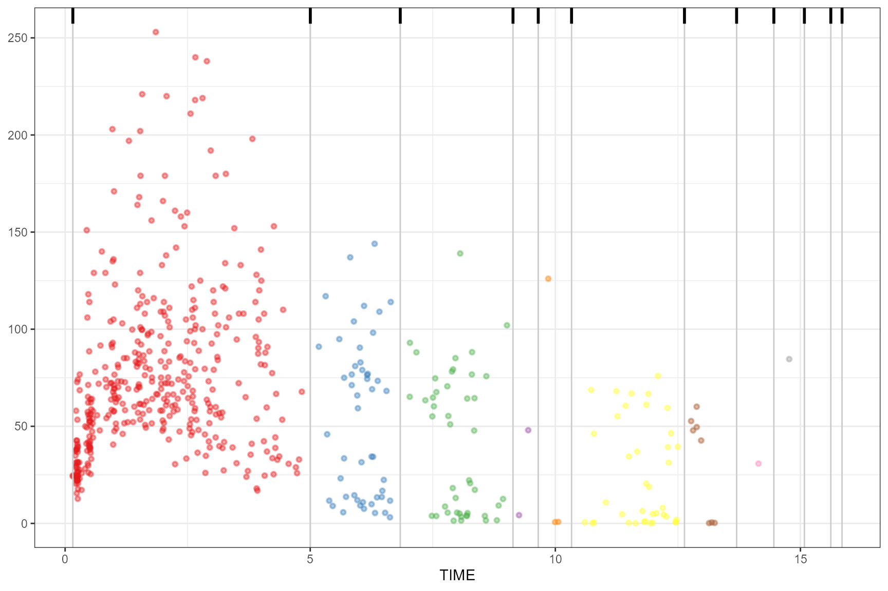

Including additional `nbins` argument.

``` r

observed(obs_data, x = TIME, y = DV) |>
  simulated(sim_data, y = DV) |>
  binning(bin = "maximum", nbins = 7) |>
  plot()
```

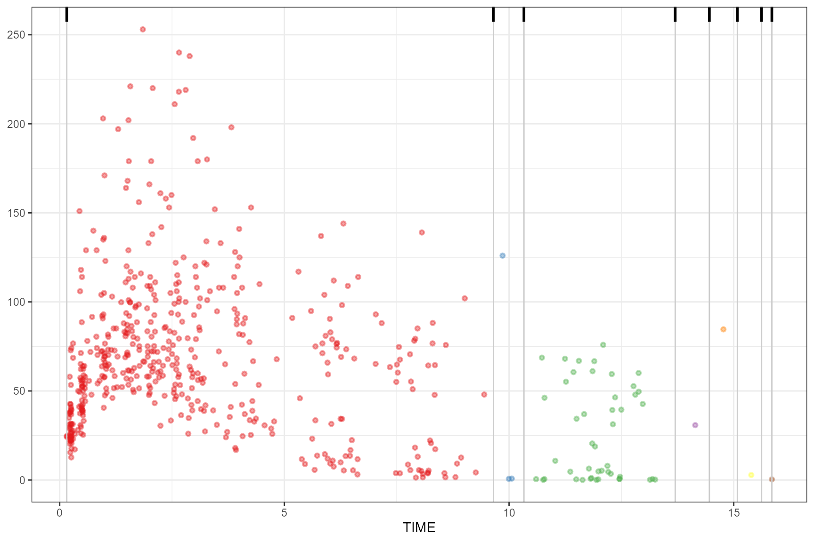

#### `box`

``` r

observed(obs_data, x = TIME, y = DV) |>
  simulated(sim_data, y = DV) |>
  binning(bin = "box") |>
  plot()
```

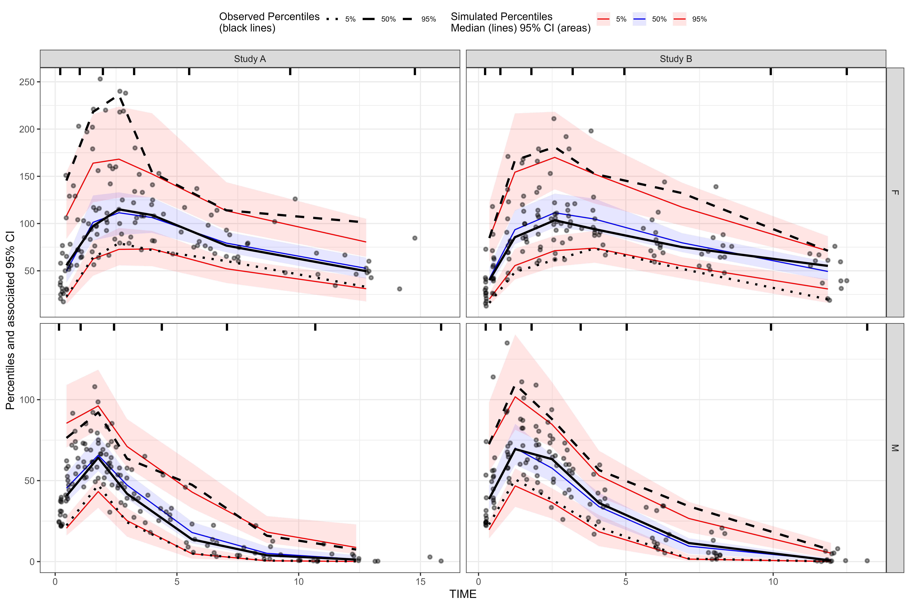

Including additional `iqr_mult` and `type` argument.

``` r

observed(obs_data, x = TIME, y = DV) |>
  simulated(sim_data, y = DV) |>
  binning(bin = "box", iqr_mult = 4) |>
  plot()
```

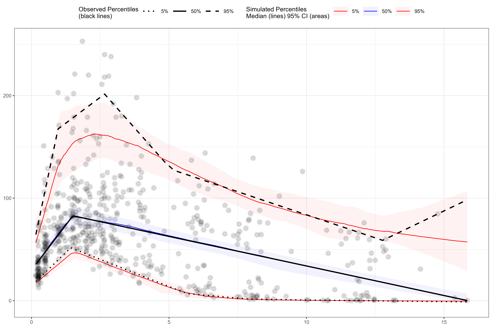

``` r


# additional (quantile) type arg
observed(obs_data, x = TIME, y = DV) |>
  simulated(sim_data, y = DV) |>
  binning(bin = "box", type = 3) |>
  plot()
```

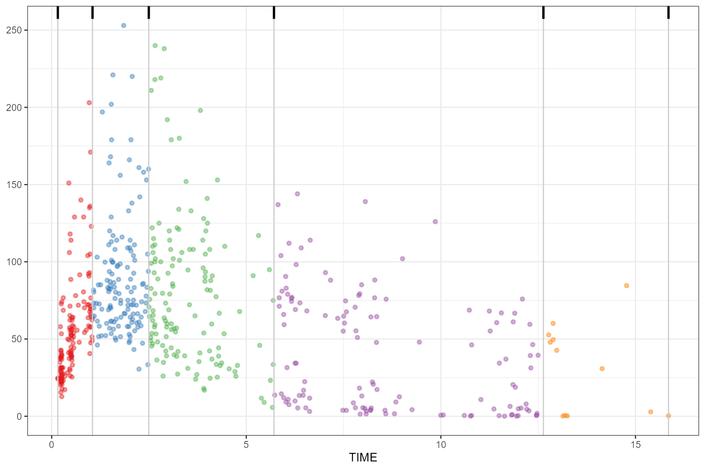

### Additional flexibility for binless() + predcorrect()

Users may now execute
[`predcorrect()`](https://github.com/certara/tidyvpc/reference/predcorrect.md)
either before, or after calling `binless(loess.ypc=TRUE)`. Previously,
you were required to execute
[`predcorrect()`](https://github.com/certara/tidyvpc/reference/predcorrect.md)
before `binless(loess.ypc=TRUE)`, otherwise you’d receive an error.

The following code below produces equivalent output:

``` r

observed(obs_data, x = TIME, y = DV ) |>
  simulated(sim_data, y = DV) |>
  stratify(~ GENDER) |>
  predcorrect(pred=PRED) |> #before binless()
  binless(loess.ypc=TRUE) |>
  vpcstats() |>
  plot()

observed(obs_data, x = TIME, y = DV ) |>
  simulated(sim_data, y = DV) |>
  stratify(~ GENDER) |>
  binless(loess.ypc=TRUE) |> 
  predcorrect(pred=PRED) |> #after binless()
  vpcstats() |>
  plot()
```

## tidyvpc 1.3.0

An overview of updates to
[`plot()`](https://rdrr.io/r/graphics/plot.default.html) function in
`tidyvpc v1.3.0`

------------------------------------------------------------------------

Set plot output dimensions:

``` r

knitr::opts_chunk$set(fig.width=12, fig.height=8, dpi = 300) 
```

### One sided stratify() formula uses facet_wrap()

``` r

library(tidyvpc)
library(magrittr)
obs_data <- obs_data[MDV == 0]
sim_data <- sim_data[MDV == 0]

vpc <- observed(obs_data, x=TIME, y=DV) %>%
  simulated(sim_data, y=DV) %>%
  stratify(~ GENDER) %>%
  binless() %>%
  vpcstats()

plot(vpc)
```

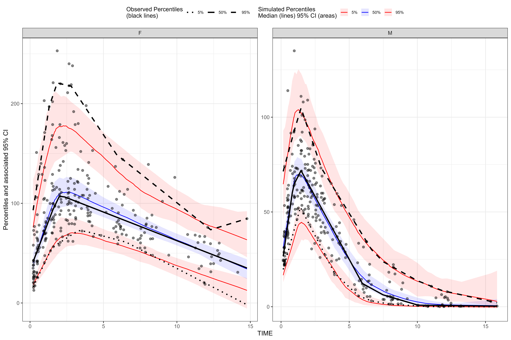

``` r

vpc <- observed(obs_data, x=TIME, y=DV) %>%
  simulated(sim_data, y=DV) %>%
  stratify(~ GENDER + STUDY) %>%
  binning(bin = "jenks", nbins = 8) %>%
  vpcstats()

plot(vpc)
```

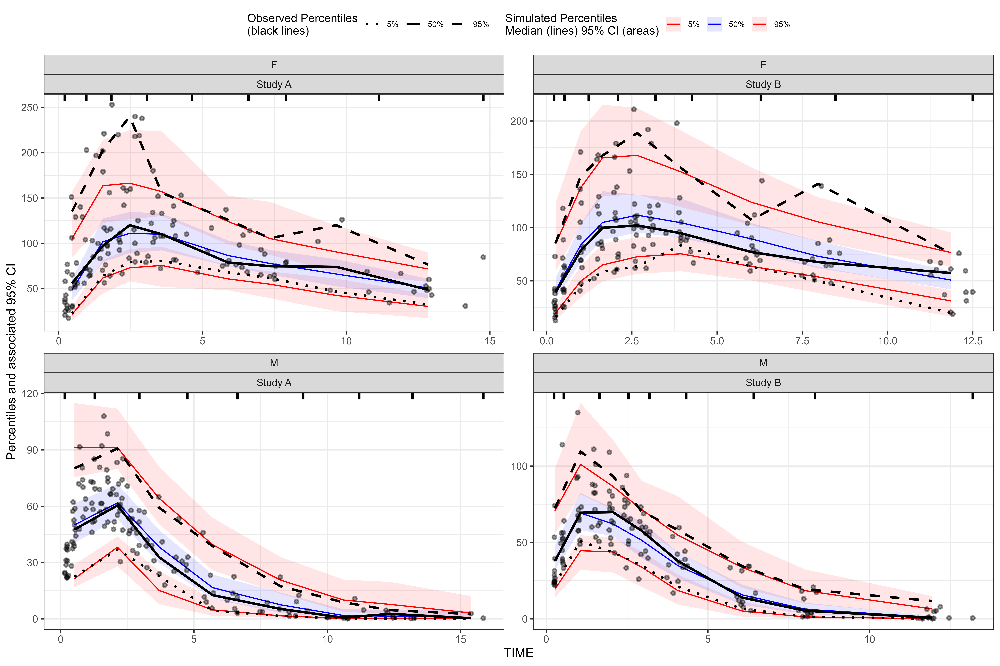

### Two-sided formula uses facet_grid()

``` r

vpc <- observed(obs_data, x=TIME, y=DV) %>%
  simulated(sim_data, y=DV) %>%
  stratify(GENDER ~ STUDY) %>%
  binning(bin = "kmeans", nbins = 6) %>%
  vpcstats()

plot(vpc)
```

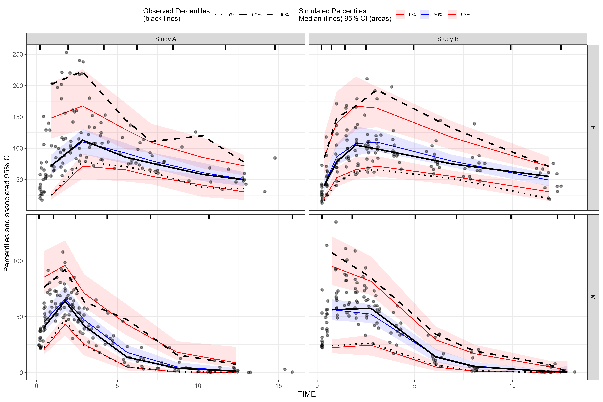

### Using facet = TRUE argument

We can use facet = TRUE argument to facet continuous VPC by quantile or
facet categorical VPC by predicted probability.

``` r

vpc <- observed(obs_data, x=TIME, y=DV) %>%
  simulated(sim_data, y=DV) %>%
  binless() %>%
  vpcstats()

plot(vpc, facet = TRUE, point.alpha = 0.1, point.size = 1, ribbon.alpha = 0.2)
```

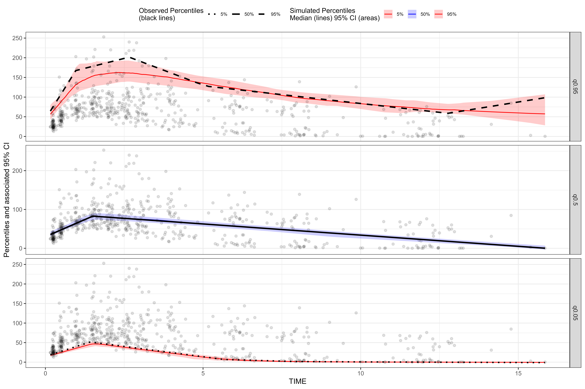

``` r

vpc <- observed(obs_cat_data, x = agemonths, yobs = zlencat) %>%
  simulated(sim_cat_data, ysim = DV) %>%
  binless() %>% 
  vpcstats(vpc.type = "categorical")

plot(vpc, facet = TRUE, legend.position = "bottom")
```

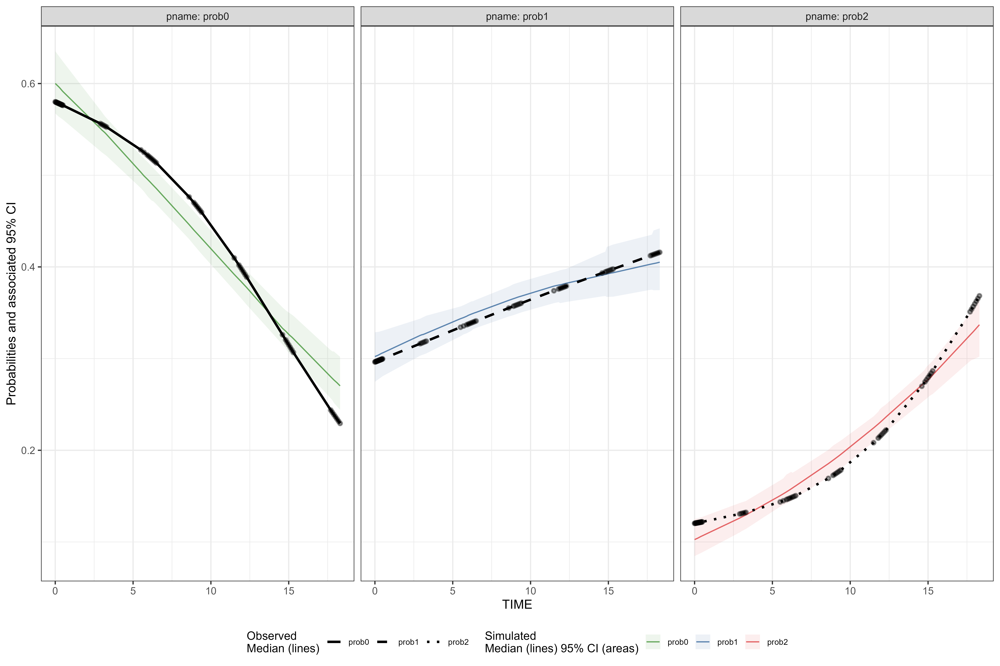

### Changing point size, point alpha, point shape, point stroke, and ribbon alpha

Setup categorical VPC.

``` r

vpc <- observed(obs_cat_data, x = agemonths, yobs = zlencat) %>%
  simulated(sim_cat_data, ysim = DV) %>%
  binning(bin = round(agemonths, 0)) %>%
  vpcstats(vpc.type = "categorical")
```

Adjust point size.

``` r

plot(vpc, point.size = 4)
```

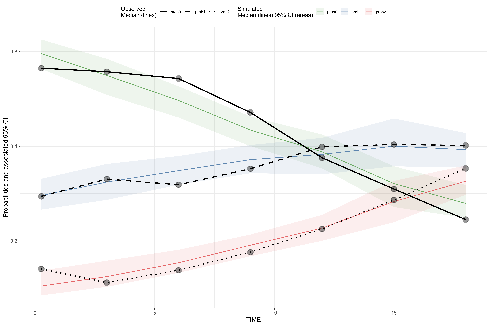

Setup continuous VPC.

``` r

vpc <- observed(obs_data, x=TIME, y=DV) %>%
  simulated(sim_data, y=DV) %>%
  binless() %>%
  vpcstats()
```

``` r

plot(vpc, point.size = 1.5, point.stroke = 2.5, point.alpha = 0.1, ribbon.alpha = 0.05)
```

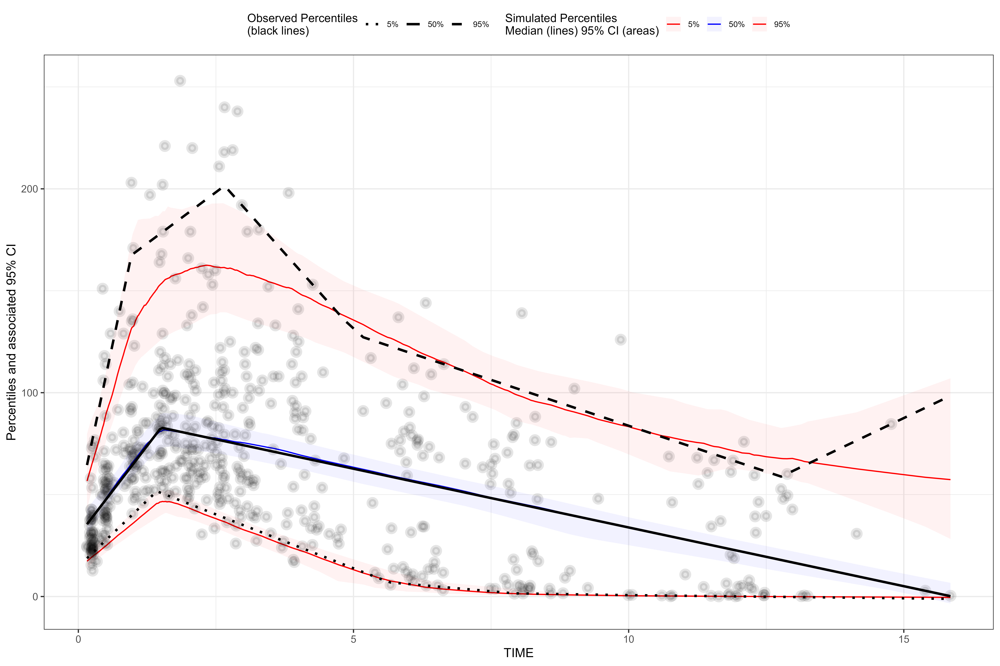

``` r

plot(vpc, point.size = 5, point.stroke = 0.3, point.shape = "triangle")
```

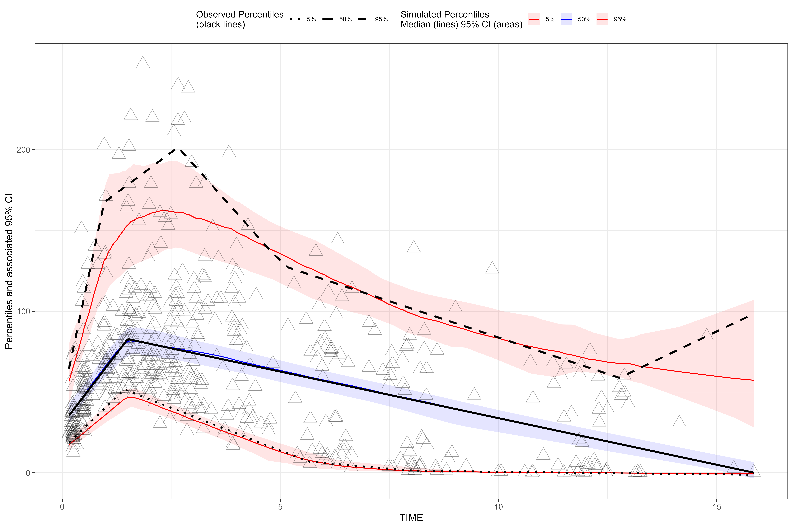

``` r

plot(vpc, point.size = 7, point.shape = "square-fill", point.alpha = 0.1, ribbon.alpha = 0.5)
```

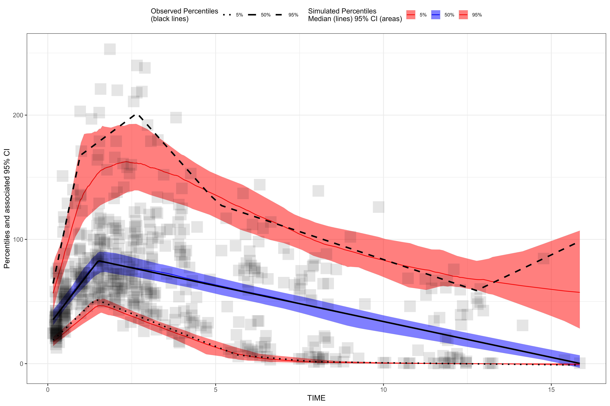
